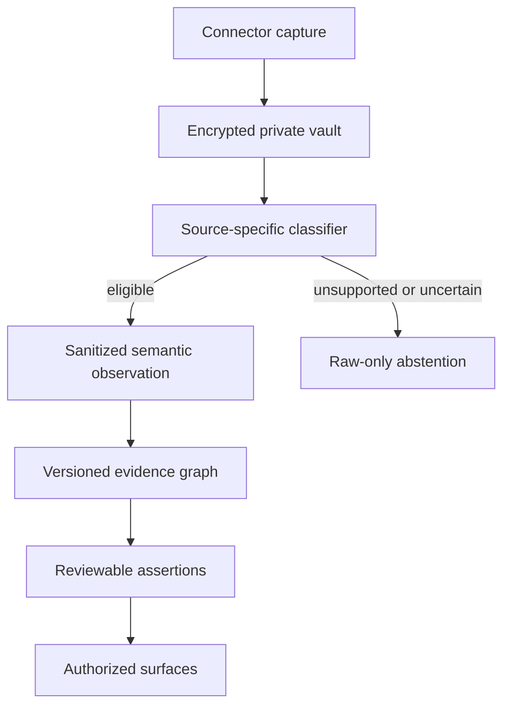

# Written semantic system starter v0.3.1

This package is an engineering handoff for Written's private ingestion,
ontology, Memories, purpose-scoped matching, directional bio selection, and
match-authorized icebreakers. Its governing rule is **capture broadly,
promote narrowly, label rigorously**: user-authorized source records may be
retained in an encrypted private evidence store even when they produce no
semantic claim. It contains unit-testable decision code and a versioned
Postgres reference schema, but it is not a fully wired or deployed product
service and is not a drop-in migration for the current Written app.

## START HERE

Read and execute the package in this order:

1. [`docs/ENGINEERING_HANDOFF_V0.3.md`](docs/ENGINEERING_HANDOFF_V0.3.md) —
   v0.3.1 verdict, engineer response, data flow, migration, and rollout plan.
2. [`docs/ENGINEERING_SPEC.md`](docs/ENGINEERING_SPEC.md) — authoritative
   product semantics, algorithms, privacy rules, status, and implementation
   sequence.
3. [`docs/WRITTEN_REPOSITORY_INTEGRATION.md`](docs/WRITTEN_REPOSITORY_INTEGRATION.md)
   — pinned current-app inventory, namespace adaptation, dual-write, shadow,
   cutover, rollback, KMS, and native-upgrade gates.
4. This README — reference-package map and local commands.
5. [`docs/ARCHITECTURE.md`](docs/ARCHITECTURE.md) — runtime, tenancy,
   concurrency, and promotion boundaries.
6. [`docs/ACCEPTANCE_TESTS.md`](docs/ACCEPTANCE_TESTS.md) — automated and
   production acceptance gates.
7. [`docs/VALIDATION.md`](docs/VALIDATION.md) — checks actually executed and
   remaining native deployment validation.

[`docs/EXAMPLE_EXPORT_REVIEW.md`](docs/EXAMPLE_EXPORT_REVIEW.md) is a
historical aggregate adapter audit. It is not the v0.3.1 inference contract and
contains no packaged user-level export.

The repository overlay is pinned to `Shinghei98/Written` commit
`8203353532dffd5f608df92861fd8a631dc7b7d4`, whose migration head is
`0041_collaborator.sql`. That repository already contains prototype ingestion,
Memories/dashboard, discovery, match-profile, and icebreaker components. They
are present legacy seams to adapt or replace—not constraints on the ontology
and not evidence that v0.3.1 is integrated.

Status terms are used consistently throughout the handoff:

| Status | Meaning |
|---|---|
| Implemented decision core | Deterministic Python logic exists and is directly unit tested |
| Schema-ready | Migration tables, constraints, triggers, RLS, and SQL contract tests exist |
| Present legacy—adapt/replace | A current app component exists, but its contract is not the v0.3.1 semantic authority |
| Integration-required | Production repositories, handlers, adapted app migrations, RPCs, connector catalogs, or iOS wiring still must be built and validated |
| Future | Deliberately deferred until policy approval or sufficient outcome data |

In particular, applying the standalone reference migrations does not create production repositories,
registered product handlers, iOS flows, or cross-user client APIs. The
default-deny schema intentionally exposes neither broad cross-user table reads
nor client-authored bio/icebreaker reads. Reference migration 004 contains the product
surface contracts. Reference migration 005 adds the encrypted raw-record boundary,
purpose-limited HealthKit fitness derivation, bilateral fitness grants, and
first-exposure validation for icebreakers. Reference migration 006 adds
current-source-state and server-owned surface hardening.

Reference migration 005 validates retention state but does not schedule time-based expiry.
A production worker must purge raw-vault payloads at `retained_until`.

The reference SQL uses schemas `private`, `ontology`, and `api`. The Written
app already owns unrelated objects under `private`; its adapted migrations must
translate semantic `private.*` objects to `semantic_private.*`, use the next
available app migration number (`0042+` at the pinned head), and pass the real
`0001–0041` upgrade suite. Never run reference `001–006` unadapted against the
Written production database.

The framework is deliberately **ontology-first and learning-assisted**. With
30–50 initial users, the product can learn mapping errors, display acceptance,
new vocabulary, and safe evidence thresholds. It must not ask a small
unsupervised model to invent semantic truth or identity claims.

## What is included

- A Supabase/Postgres schema for immutable source observations, versioned
  concepts and typed edges, mapping provenance, user assertions, feedback,
  suppressions, source coverage, cross-source inference runs, candidate terms,
  embeddings, and a database-backed worker queue.
- Row-level security plus atomic RPCs for one-tap removal and explicit
  addition. A removal RPC has no reason parameter by design.
- A runnable, dependency-free synthetic mechanics demo with source-aware mapping,
  saturation, missing-aware late fusion, typed graph convergence,
  leave-one-source-out stability, and a sensitive-inference firewall.
- A Wikidata adapter behind a provider interface. Online knowledge can propose
  candidate entities and relations, but cannot publish a user assertion.
- A separate feedback learner for semantic validity versus surfacing
  acceptance.
- Unit tests for convergence mechanics, source-volume saturation, missing
  views, duplicate evidence, fail-closed adapters, ambiguous mappings,
  additions, removals, prohibited identity inference, cross-connector calendar
  deduplication, explicit-profile routing, and purpose-limited HealthKit
  ingestion with thresholded abstention.
- A versioned, domain/source/action-specific recency policy. It separates
  temporal weight from missing-timestamp quality, supports scheduled-event
  anticipation and post-event decay, and records rule/status/as-of provenance.
- One immutable Python source-policy catalog shared by the adapter and mapper,
  exact SQL parity for its reliability/action weights, and source-specific
  gating before observation construction. Reference migration 004 historically allowed
  a generic Calendar mapping only after an eligible allowlisted classification;
  reference migration 005 supersedes that compatibility path and blocks every Calendar
  observation from `observation_mappings`. Classifications remain metadata;
  semantic promotion occurs only through current typed travel/booking candidates.
  Generic source-row mapping is fully closed for Calendar and HealthKit. Raw,
  aggregate, workout-session, and typed-private sleep Health rows never
  alias-map; only an exact validated workout-candidate projection may cross the
  closed fitness persistence handoff.
- Decision cores for allowlist-first Calendar classification, travel journey
  reconstruction, YouTube channel-role resolution, conserved addition
  granularity, Memories grouping/editing, directional dyadic transport,
  subject-only bio selection, and licensed icebreaker frames.
- Migration `004_product_surfaces.sql` for YouTube identities and run gates,
  canonical travel/journey lineages, scheduled travel and typed booked-activity
  candidates, assertion surface permissions, Memories snapshots, directional
  dyad outputs, bio variants, match authorization, and icebreaker frames.
- Migration `005_private_ingestion_and_fitness.sql` for encrypted/blob-backed
  private raw retention, sanitized Calendar/fitness projections, typed fitness
  feature snapshots, validated habit support, independent HealthKit-use grants,
  purpose-locked dyads, and exposed-versus-provisional icebreaker lifecycle.
- Migration `006_current_state_and_surface_hardening.sql` for per-run
  current-state membership, per-scope ordering, service-owned terminal run
  transitions, complete-full-snapshot absence safeguards, and stricter
  server-owned surface boundaries. Pre-006 facts without a recorded exact
  score/revision attestation are retired—not assigned one during upgrade—and
  their linked ready bios and unexposed icebreakers become stale. Match
  authorization uses immutable participant epochs with at most one active
  match per unordered user pair. Its standalone contracts are not a substitute
  for the app-specific `0001–0041 → 0042+` upgrade test.
  Finalized partial, truncated, and delta scopes may affirm or update items they
  actually report; only a finalized complete full snapshot may infer absence
  from an omitted item.
- Closed payload contracts for all eleven queue job types. For a registered
  handler, both Python and SQL validate the exact ID-only control message; SQL
  also closes result, error, lock-owner, and idempotency fields. A missing
  handler fails closed as `dead_no_handler`; a malformed or private payload
  fails as `dead_invalid_payload`, with a sanitized error code. Invalid legacy
  queue rows become content-free dead tombstones rather than retaining raw
  payloads or diagnostics.

See [`docs/VALIDATION.md`](docs/VALIDATION.md) for the exact executed checks
and remaining native Supabase deployment validation.

## Architecture

The detailed runtime, schema, concurrency, and promotion contracts are in
`docs/ARCHITECTURE.md`.



The system stores five different objects that must never be collapsed:

| Object | Meaning | Example |
|---|---|---|
| Observation | What a connector measured | A track play or calendar reservation |
| Mapping | Why an observation may support a concept | Track metadata says `Italian` |
| Concept | A reusable semantic node | Italian music or Italy |
| Assertion | A defeasible statement about one user | Recurring Italian-cultural affinity |
| Surface decision | Whether Written should show it | Visible, confirmed, or hidden by user |

## Feedback contract

### Addition

An addition is an explicit positive user action.

- If the user selects an existing concept, create a confirmed assertion.
- If the user supplies a new term, store it first as a user-private term. It
  becomes a global candidate only after privacy-safe aggregation and review.
- If the addition is linked to one or more observations, it is also a strong
  positive observation-to-concept training label.
- If it is not linked to an observation, it teaches user affinity but **does
  not** teach that any raw item mapped to the concept.

### One-tap removal

A removal means only: **do not show this assertion to this user again**.

- It atomically hides the assertion and creates a user-specific suppression.
- It updates the surfacing-acceptance head as an ambiguous negative.
- It does not create a negative-interest assertion.
- It does not globally invalidate the semantic mapping, because the user may
  have removed an accurate item for privacy, wording, or relevance.
- Repeated removals of the same rule or wording are batch diagnostics. They can
  lower promotion priority after a minimum-user threshold, but they cannot
  silently rewrite the ontology.

This separation is the most important design choice in the scaffold.

## Quick start: offline demo

No database, API key, or third-party package is needed.

```bash
cd written-ontology-starter
PYTHONPATH=src python -m written_ontology.cli demo
PYTHONPATH=src python -m unittest discover -s tests -v
```

The current package baseline is **244/244 Python tests passing** when
`WRITTEN_REPOSITORY_PATH` points to the pinned Written checkout, including
**14/14 HealthKit tests**. Without that environment variable, the checkout
manifest test is intentionally skipped.

The pre-labeled synthetic demo maps Italian music, film, and dining observations to reusable nodes,
then converges them on `place:italy`. It may produce an `affinity:culture:italy`
review candidate. It demonstrates deterministic convergence mechanics, not
semantic discovery or calibrated accuracy. It must never produce ancestry,
nationality, native language, or family-root claims.

To inspect or adapt the current Written eight-column CSV without printing its
row content:

```bash
PYTHONPATH=src python -m written_ontology.cli inspect-export /path/to/export.csv
PYTHONPATH=src python -m written_ontology.cli adapt-export /path/to/export.csv
```

The aggregate findings from the supplied example are documented in
`docs/EXAMPLE_EXPORT_REVIEW.md`; the personal CSV itself is intentionally not
packaged.

## Quick start: Supabase/Postgres

1. Enable the `vector` extension in Supabase.
2. In a disposable validation database, run the clean standalone 001–006 path. The first
   three contracts intentionally describe the pre-004 surface whitelist. Replay
   004 and 005 before their respective contracts, then apply/replay 006 and run
   its contract:

```bash
psql "$DATABASE_URL" -f sql/001_schema.sql
psql "$DATABASE_URL" -f sql/002_rls_and_rpc.sql
psql "$DATABASE_URL" -f sql/003_seed.sql
psql "$DATABASE_URL" -f sql/tests/001_version_rollover.sql
psql "$DATABASE_URL" -f sql/tests/002_integrity_contract.sql
psql "$DATABASE_URL" -f sql/tests/003_exact_revision_finalization.sql
psql "$DATABASE_URL" -f sql/004_product_surfaces.sql
psql "$DATABASE_URL" -f sql/004_product_surfaces.sql
psql "$DATABASE_URL" -f sql/tests/004_product_surfaces_contract.sql
psql "$DATABASE_URL" -f sql/005_private_ingestion_and_fitness.sql
psql "$DATABASE_URL" -f sql/005_private_ingestion_and_fitness.sql
psql "$DATABASE_URL" -f sql/tests/005_private_ingestion_and_fitness_contract.sql
psql "$DATABASE_URL" -f sql/006_current_state_and_surface_hardening.sql
psql "$DATABASE_URL" -f sql/006_current_state_and_surface_hardening.sql
psql "$DATABASE_URL" -f sql/tests/006_current_state_and_surface_hardening_contract.sql
```

3. In a second disposable database, exercise the persisted 004→005 upgrade and
   replay path. The synthetic fixture deliberately stores legacy Calendar
   classification, generic mapping, typed candidate, and Memories state before
   005 is applied:

```bash
psql "$DATABASE_URL" -f sql/001_schema.sql
psql "$DATABASE_URL" -f sql/002_rls_and_rpc.sql
psql "$DATABASE_URL" -f sql/003_seed.sql
psql "$DATABASE_URL" -f sql/004_product_surfaces.sql
psql "$DATABASE_URL" -f sql/tests/fixtures/004_calendar_upgrade_fixture.sql
psql "$DATABASE_URL" -f sql/005_private_ingestion_and_fitness.sql
psql "$DATABASE_URL" -f sql/005_private_ingestion_and_fitness.sql
psql "$DATABASE_URL" -f sql/tests/005_calendar_upgrade_contract.sql
psql "$DATABASE_URL" -f sql/006_current_state_and_surface_hardening.sql
psql "$DATABASE_URL" -f sql/006_current_state_and_surface_hardening.sql
psql "$DATABASE_URL" -f sql/tests/006_current_state_and_surface_hardening_contract.sql
```

4. In a third disposable database, preserve pre-006 surface facts and products,
   then prove that 006 retires unverifiable facts without fabricating historical
   attestation:

```bash
psql "$DATABASE_URL" -f sql/001_schema.sql
psql "$DATABASE_URL" -f sql/002_rls_and_rpc.sql
psql "$DATABASE_URL" -f sql/003_seed.sql
psql "$DATABASE_URL" -f sql/004_product_surfaces.sql
psql "$DATABASE_URL" -f sql/005_private_ingestion_and_fitness.sql
psql "$DATABASE_URL" -f sql/tests/fixtures/005_surface_fact_upgrade_fixture.sql
psql "$DATABASE_URL" -f sql/006_current_state_and_surface_hardening.sql
psql "$DATABASE_URL" -f sql/006_current_state_and_surface_hardening.sql
psql "$DATABASE_URL" -f sql/tests/006_surface_fact_upgrade_contract.sql
```

The current PGlite matrix passes all three lanes: clean standalone
001–006/replay, the persisted internal 004→005 Calendar fixture followed by
006/replay, and the persisted 005→006 surface-fact upgrade followed by 006
replay. Details are in `docs/VALIDATION.md`. Native two-session races, native
Supabase/PostgreSQL execution, and the adapted Written
`0001–0041 → 0042+` upgrade remain separate release gates.

5. Optionally install the database adapter and exercise queue mechanics only
   against an empty disposable queue:

```bash
python -m pip install -e '.[postgres]'
written-ontology worker --once
```

Do not run this command against queued v0.3.1 product work until the production
repositories and handlers are registered.

The included queue runner provides `FOR UPDATE SKIP LOCKED`, lease recovery,
idempotent job keys, retry/dead-letter behavior, safe failure, and a closed
typed registry for all eleven payloads. The offline demo is runnable end to end.
Product decision cores exist, but production repositories and registered
handlers for Calendar classification, YouTube resolution, Memories, dyads,
bios, and icebreakers remain integration-required. Do not start a production
poller for those jobs until the repositories/handlers are wired and tested. An
unknown, malformed, or privacy-forbidden payload is never dispatched or marked
successful.
Every claim receives a fresh lease token. Every handler must also make its
database side effects idempotent because a process can crash after committing
work but before acknowledging the job.

The standalone reference RPCs cover owner review actions only. The current app
has legacy cross-user discovery and match-profile paths, but new cross-user
bio and icebreaker RPCs remain integration-required and must prove viewer
authorization, active match state where applicable, and both current user
revisions. The worker should run with a server-only Postgres/service
credential. Never ship that credential in the app.

## Mapping order

The resolver uses evidence in this order:

1. Stable provider IDs and connector-supplied structured metadata.
2. Curated exact aliases and typed ontology edges.
3. Curated fuzzy aliases within a compatible concept kind.
4. Embedding retrieval as candidate generation, not logical entailment.
5. Online knowledge as a cached, provenance-bearing candidate.
6. Recurring-term/co-context discovery as a review queue, not an automatic
   global merge.

Source-specific adapters should send structured fields such as creator, genre,
language, category, and venue. The semantic worker
should not infer from an entire opaque vendor payload when a structured field
exists.

Current v0.3.1 boundaries:

| Source | Boundary |
|---|---|
| Apple Music / Spotify | Exclude recommendations; deduplicate library, playlist, rating and recent rows by content lineage |
| YouTube | Provider topics are the only default-on semantic terms; stable channel identity, represented creator, publisher, content subject, and fan/repost roles stay separate; derived fields, cross-source fusion, bio, and icebreaker use require an audited capability mode |
| Calendar | Classify locally with exclusions before allowlisting; flights create journey-terminal `scheduled_travel_to`, Ticketmaster/Eventbrite-style receipts create `booked_event`, OpenTable/Resy-style receipts create `scheduled_dining`, and other leisure receipts create `booked_activity_at`; never send event text to online knowledge services |
| Podcasts | Resolve public show, host and catalog-category metadata |
| HealthKit / Motion & Fitness | Accept four closed private record types (`activity_day`, `activity_hour`, `workout`, `sleep`); keep raw rows out of the generic mapper; retain sleep only as typed-private coverage; derive controlled exercise routines only from qualifying workouts; aggregates and sleep never nominate a semantic candidate |

The YouTube cross-source boundary is enforced in the decision core. Evidence
with `cross_source_fusion_allowed=false` may retain a source-local score, but
the scorer removes it from breadth, synergy, and convergence motifs; it is not
merely an informational flag.

> Written retains HealthKit as an optional, purpose-limited fitness-connection
> input. Activity and workout data help users find people with compatible
> exercise routines and support shared exercise and sustained fitness habits.
> HealthKit data are not used for advertising, general desirability scoring,
> unrelated dating profiling, external resolution, or population-model
> training. Sparse or low-modality data produce abstention. Users separately
> control fitness matching and public naming/explanation; confirmation never
> removes HealthKit provenance or its fitness-purpose restriction.

HealthKit data also never enter generic embeddings or global term mining.
Structured sleep sessions may be accepted only as typed-private coverage for
ingestion completeness and quality. In v0.3.1 they never create a sleep-schedule
or other semantic candidate and are never eligible for matching, naming,
explanation, or another public/product surface. The reserved
`routine:consistent_sleep_schedule` ontology seed does not authorize promotion.
This design is reviewable under Apple's health/fitness-purpose rules, but it is
not a promise of App Review approval.

An export's self-asserted `catalog_verified` field cannot enable online
resolution. The server must inject a trusted catalog-identity verifier (for
example, one backed by connector signatures or provider IDs). That verifier
receives only source, resource namespace, and catalog ID fields—never titles,
creators, Calendar text, or HealthKit data.

## Calendar travel and home-base boundary

A single well-structured airline or leisure ticket is a deliberate user action
and can be high-confidence evidence that something was scheduled or booked.
It does not need proof from another app. The private Memories predicate must
remain no stronger than the receipt: for example, `scheduled_travel_to` or
`booked_activity_at`, never `visited`, `attended`, or `likes` without user
confirmation.

Recurrence is a separate computation over distinct journeys, not event rows,
legs, mirrored connectors, or multiple reservations inside one trip. It is
required only for recurrence wording such as "recurs" or "often returns."
A private recurrence-review row requires at least two journeys, two distinct
months, and a 90-day span. Public "often returns" wording additionally requires
at least three journeys, two complete round trips, a 180-day span, explicit
user confirmation, and the relevant surface permission. Repeated travel may
create a private question about a recurring connection or possible base. It
may never machine-write `hometown` or `lives_in`; those predicates require an
explicit user assertion.

The Calendar classifier excludes birthdays, medical events, funerals and
memorials, friends' or colleagues' events, weddings and private parties, and
work/school/meeting events before it considers commercial signatures. Unknown
entries fail closed. Explicit third-party ownership, shared third-party
calendars, and declined attendance also fail closed unless a separate typed
artifact proves that the user owns the booking. Exact dates, routes, flight
numbers, booking references,
hotels, organizer/contact data, and future itinerary context are private
evidence and cannot appear in a bio or icebreaker.

Those exclusions govern **semantic promotion**, not private collection. With
the user's authorization, complete Calendar records may be stored in the
separate encrypted raw-evidence vault for classification, reprocessing, audit,
and deletion. Raw titles, routes, contacts, and booking details may not enter
generic ontology terms, classifier-feature JSON, queues, logs, or presentation
payloads. Unknown entries fail closed at the ontology boundary while remaining
available for a later, versioned classifier—not silently discarded.

Reference migration 005 supersedes every legacy generic Calendar mapping. It retains
legacy typed classification/travel/booking rows as private audit history, sanitizes
their presentation payloads, bumps each affected user's revision, and queues
reclassification. The retained rows are non-current and ineligible for use
after that bump; promotion resumes only from an eligible classification at the
new revision and a rebuilt typed candidate.

Calendar presentation labels are server-controlled. Versioned templates supply
the predicate wording, active ontology revisions supply canonical target/place
labels, and Memories copies that controlled payload from the current typed
candidate. Connector titles, locations, and client-authored labels cannot become
display text.

## Cross-source scoring

For source \(s\) and concept \(c\), evidence saturates within source:

\[
E_{usc}=1-\exp\left(-\sum_i q_i m_{ic} w_i t_i r_i\right)
\]

Here `t` is the versioned recency weight and `r` is timestamp quality. They are
separate: a missing timestamp remains usable at a reduced policy-specific
weight/quality, rather than becoming fresh or zero. Each decision records
`recency_policy_version`, `recency_rule_id`, `recency_status`, timestamp
quality, and one run-pinned `recency_as_of`. Watched/generic video behavior
decays faster than likes; subscriptions/library saves are enduring; scheduled
Calendar events anticipate toward the event and decay afterward. There is no
universal half-life.

Then sources are fused late with a noisy-OR base and capped cross-source
synergy:

\[
S_{uc}=1-\prod_s(1-\alpha_{sc}E_{usc})
       +\sum_{s<t}\gamma_{stc}E_{usc}E_{utc}
\]

The implementation returns separate strength, mapping agreement, evidence
quality, breadth, stability, and surfacing state. Mapping agreement is not a
calibrated probability. Missing or denied sources remain missing; they are
never converted into evidence of no interest. One canonical content lineage
cannot manufacture breadth by appearing through two connectors.

## Online knowledge boundary

`WikidataProvider` uses entity search and a minimized allowlist from direct
entity JSON. Candidate data carries provider, external ID, retrieval time,
payload hash, license, and retrieval rank. New nodes and edges remain
`candidate` until curated or promoted by an explicit policy.

Online knowledge must not:

- create a user identity claim;
- turn creator nationality into user nationality;
- turn language of consumed media into native language;
- infer health, religion, ethnicity, sexuality, politics, or family roots;
- bypass the same user-review and provenance rules as local mappings.

## Cold-start learning plan

| Initial evidence | What the framework learns |
|---|---|
| 5–10 users | Connector bugs, duplicate evidence, unsafe paths |
| 20–35 users | Alias errors, thresholds, wording, local subhubs |
| 10–15 untouched users | Preliminary validation of precision and acceptance |
| 100 complete users | Calibrated preliminary rules and prespecified motifs |
| 200+ users | Exploratory population-level multi-view factors |

At 30–50 users, keep model parameters small and auditable. Validate by user,
not by observation. Thousands of tracks from one person still count as one
independent person.

## Provisional hubs

`ontology/seed_concepts.csv` contains a starter registry rather than a locked
product decision. Hubs are navigation and governance anchors. Podcast,
Spotify, YouTube, Calendar, and HealthKit remain source/medium fields—not hubs.
Only thresholded, purpose-locked HealthKit routine candidates can enter the
fitness ontology path; raw quantitative records never do.
Language, creator, place, activity, genre, intention, polarity, and life stage
remain typed facets or relations.

The CSV and SQL 003 representations are parity-checked in code: 45 concepts,
42 aliases, and 37 edges must match exactly, including capitalization and
definitions. Relation/source/model/embedding/motif configuration is explicitly
SQL-only and is not synthesized from the CSV files.

The original outline is preserved in `ontology/original_outline.csv` so that
future curation decisions remain traceable.

## Production gates

Before an inferred assertion is eligible for profile text:

- every evidence path has observation, mapper, ontology, and model versions;
- the target kind is inferable and non-sensitive;
- evidence passes a source-normalized threshold;
- any claimed cross-source convergence uses independent sources, not duplicate
  imports;
- no generic cross-source requirement is imposed on a valid single-source
  action such as one strong structured ticket;
- the motif uses a curated evidence relation rather than a generic place link;
- strength, evidence quality, and stability all clear their own thresholds;
- leave-one-source-out stability is reported;
- the assertion has an explanation path suitable for user review;
- a prior suppression blocks resurfacing;
- newly learned terms or external edges have passed the promotion policy.

Calendar receipts remain Memories-only until the user confirms a stronger
predicate and separately permits public selection/naming. YouTube channel and
creator evidence remains excluded from cross-source, bio, and icebreaker use
unless the run records an approved audited policy mode.
HealthKit-derived facts are additionally locked to `fitness_connection`. The
base grant permits private review but does not enable a product surface:
`allow_fitness_matching`, `allow_bio_naming`, and
`allow_icebreaker_naming` are independent, default-off grants. Matching requires
the matching grant from both users; controlled explanation also requires its
separate grant together with the relevant bio or icebreaker naming grant.

## Primary references

- W3C SKOS distinguishes direct broader/narrower links from associative
  `related` links: https://www.w3.org/TR/skos-reference/
- PostgreSQL row-security behavior and default-deny semantics:
  https://www.postgresql.org/docs/current/ddl-rowsecurity.html
- Supabase RLS with `auth.uid()`:
  https://supabase.com/docs/guides/database/postgres/row-level-security
- pgvector distance operators and HNSW indexes:
  https://github.com/pgvector/pgvector
- Wikidata data access and stable interfaces:
  https://www.wikidata.org/wiki/Wikidata:Data_access
- Wikimedia API etiquette, including informative User-Agent and `maxlag`:
  https://www.mediawiki.org/wiki/API:Etiquette
- Apple HealthKit documentation, including health/fitness social interactions:
  https://developer.apple.com/documentation/healthkit/
- Apple Developer Program License Agreement:
  https://developer.apple.com/support/terms/apple-developer-program-license-agreement/
- Apple App Review Guidelines:
  https://developer.apple.com/app-store/review/guidelines/
