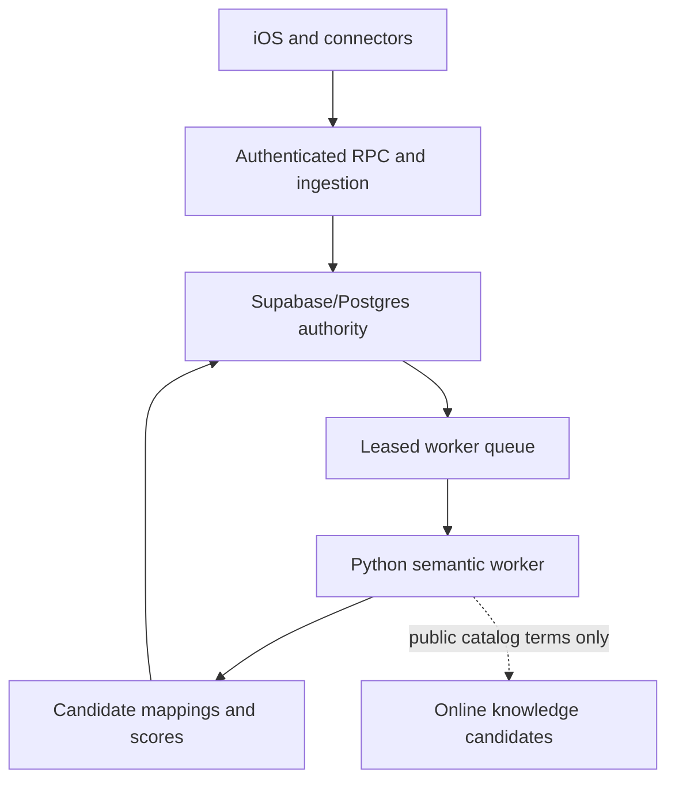
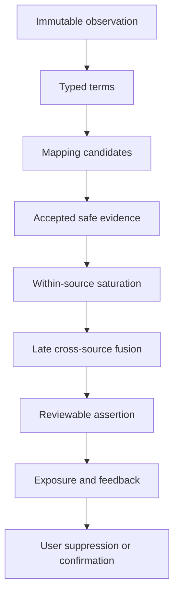
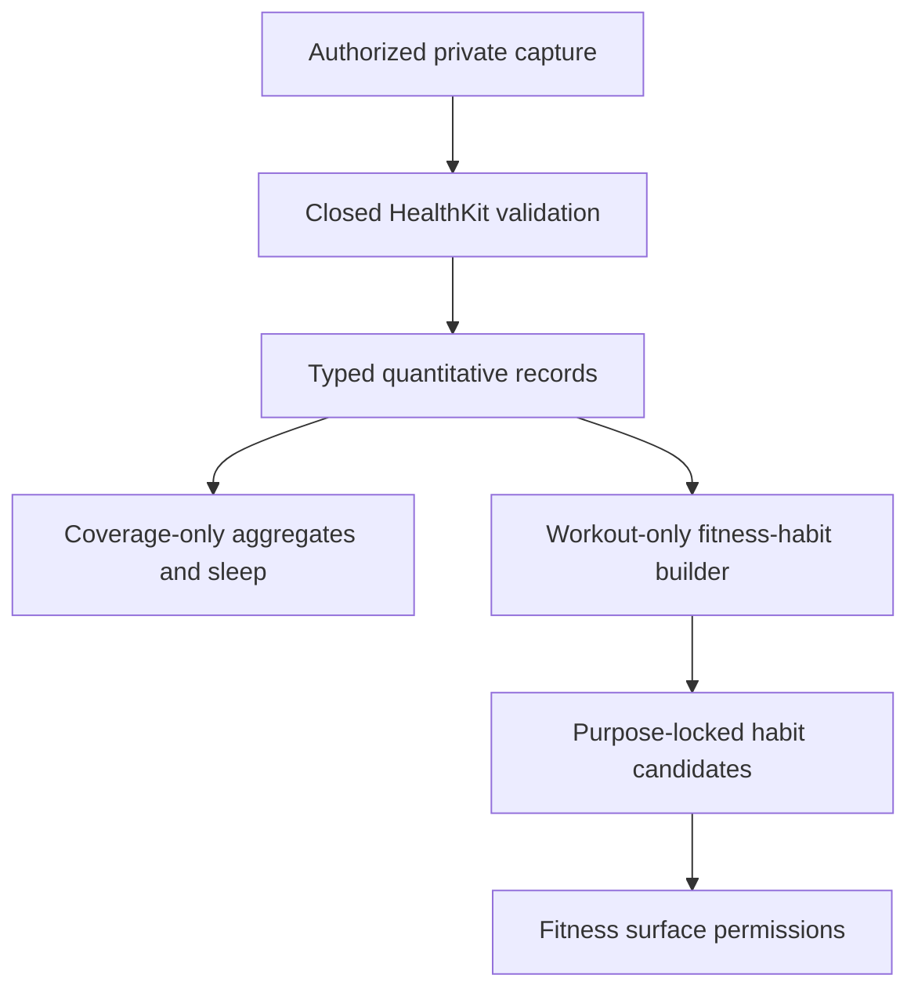
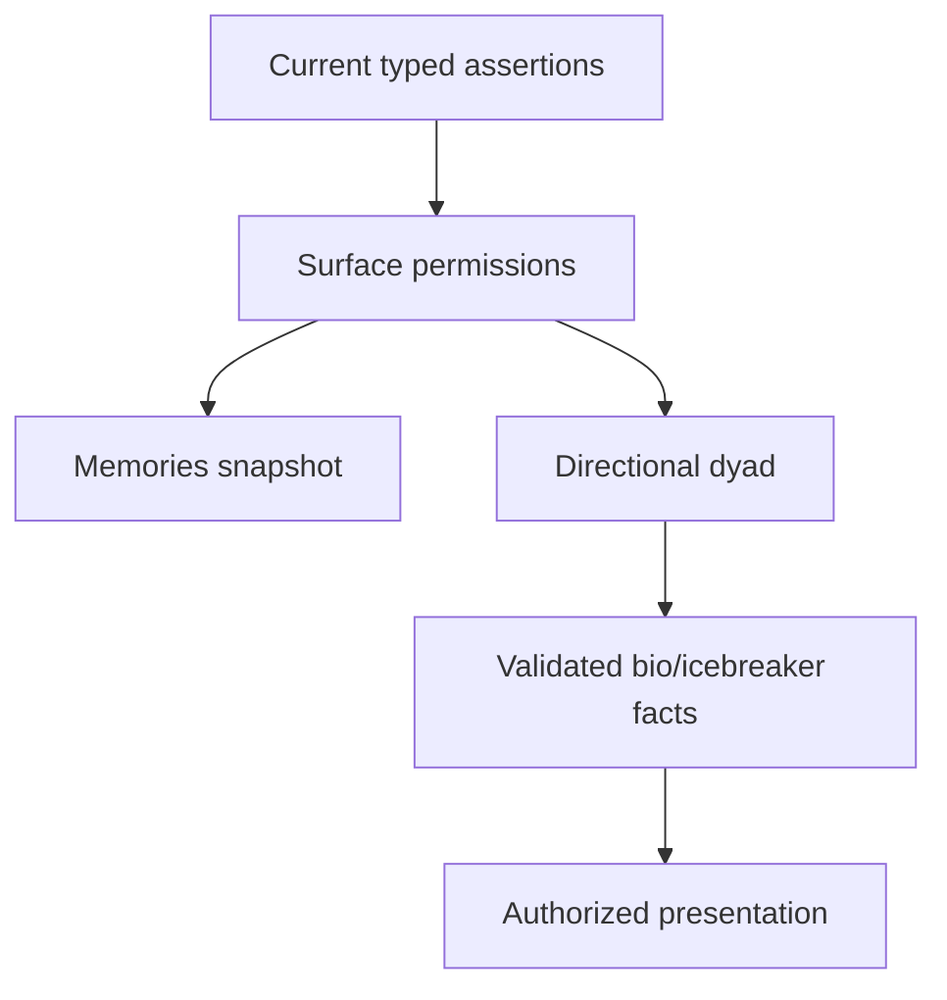

# v0.3.1 architecture

Start with [`ENGINEERING_SPEC.md`](ENGINEERING_SPEC.md). This document narrows
the authoritative v0.3.1 specification to runtime, persistence, concurrency, and
promotion boundaries.

The Python modules are deterministic decision cores. Standalone reference
migrations 001–006 and their contracts define the target persistence chain;
`VALIDATION.md` records which sequences have actually run. Native
Supabase/PostgreSQL execution remains a deployment gate. The reviewed Written
repository already has prototype iOS surfaces and cross-user paths, but those
are present legacy components to adapt or replace. Production repositories,
product job handlers, typed iOS integration, and authenticated server-owned
semantic RPCs remain integration-required. The reference schema intentionally
creates no broad cross-user client read policy.

## Runtime split

Supabase/Postgres is the authority for identity, tenancy, immutable evidence,
ontology versions, current assertions, suppressions, feedback, and job state.
The Python process is a restartable semantic worker. It may propose mappings,
scores, external entities, and motifs, but it cannot bypass database revision
checks or the final suppression filter.

The online edge is optional and fail-closed. Calendar text, HealthKit data,
unverified local filenames, and user identity never cross it. HealthKit may be
processed only inside the private, purpose-limited fitness lane described
below; enabling that lane never enables online entity resolution or global
vocabulary mining.

## Current, coexistence, and target states

The repository overlay is pinned to `Shinghei98/Written` commit
`8203353532dffd5f608df92861fd8a631dc7b7d4`, migration head 0041. Its current
path is `DistilledRecord` → `SyncService`/`append_source_records` → public
legacy records/client ontology → client-authored discovery JSON and a
match-time SQL overlap trigger. It is an implementation baseline, not a
semantic authority.

During coexistence, one connector run may write both the legacy transport and
the typed ingestion endpoint under one correlation ID. Only the new path writes
`semantic_private`; all new assertions and surfaces remain shadow-only.
Completed-run membership, not a latest-ever union, controls current state.
Backfilled rows are `legacy_unverified` until reprocessed, and a fresh complete
distillation supersedes uncertain history. The shadow comparator may measure
old/new divergence but may never promote the old label as truth.

At target state, Swift captures typed source envelopes and renders server-owned
outputs; the Python worker performs deterministic semantic decisions; Postgres
owns current revisions, authorization, promotion, and exposure. Direct client
semantic writes and broad discovery-table reads are revoked. Old tables remain
read-only only for a bounded rollback/audit window.

Rollback is forward-only and surface-specific. Runtime flags separately
control typed ingestion, shadow computation, Memories, discovery/profile
clauses, icebreaker exposure, and HealthKit. A server-side privacy kill switch
must stop promotion and cross-user exposure immediately. The safe fallback is
an omitted semantic clause—not generic Calendar/HealthKit inference,
client-authored discovery semantics, or the legacy overlap icebreaker.

## Database domains

| Schema | Owns | Client access |
|---|---|---|
| `ontology` | Version registry, concepts, labels, typed edges, model/motif definitions, external candidates, stable YouTube channels and reviewed roles | Read only through approved views/RPCs |
| `private` | Encrypted raw-source capture, source coverage, observations, mappings/scores/assertions, Calendar classifications and travel, HealthKit fitness features/grants, surface permissions, Memories, dyads, bios, match/icebreaker state, feedback, and worker jobs | Default deny; service role for backend processing |
| `api` | Security-definer user actions and safe reads | Authenticated RPC only |

These schema names describe the standalone reference. The pinned Written app
already has unrelated `private` objects through migration 0041. Its adaptation
must place semantic-private objects in `semantic_private`, leave app `private`
untouched, and expose only audited `api` RPCs. Prefer configuring Supabase and
the iOS PostgREST client for the `api` profile; minimal public wrappers are an
exception requiring their own authorization contract.

Stable concept identity is separate from its versioned revision. Version-bound
outputs record the ontology and model versions used. Publishing retires the
previous version without erasing its publication timestamp; published and
retired semantic rows are immutable.

## Encryption and worker trust boundary

The raw-vault column is only a storage contract. Production requires envelope
encryption with a KMS/HSM-controlled key-encryption key, narrowly scoped
data-encryption keys, separately keyed lineage HMACs, recorded key versions,
rotation, and audited worker decrypt. The iOS binary, Postgres row, source
repository, and generic worker environment must not contain the master key.
Plaintext must not enter queues, logs, traces, analytics, or durable errors.
Deletion must cover database ciphertext, object blobs, retry/dead-letter
artifacts, and backups under the disclosed lifecycle. Without this key and
deletion design, “encrypted raw vault” is schema-ready only.

## Evidence lifecycle

Every transition retains provenance. Candidate mappings, active ontology
edges, user assertions, and presentation state are distinct records.

Reference migration 005 defines a broad private-ingestion vault for user-authorized
source records. It stores only encrypted payload bytes or an encrypted-object
reference plus keyed identity, purpose, retention, and lifecycle metadata.
Capture in that vault is not ontology evidence. The schema validates
`retained_until`, but scheduled time-based expiry requires an application worker;
it is not an automatic database TTL. HealthKit uses a parallel, closed typed-
quantitative path before it can join the evidence lifecycle:

Reference migration 006 hardens current-state membership and product surfaces.
Finalized partial, truncated, and delta scopes may affirm or update items they
actually report, including an explicit provider deletion. Only a finalized
complete full snapshot whose coverage contract permits absence may infer that
an omitted item is absent. Failed runs and all other omissions remain unknown.
Surface current pointers likewise require server-owned, revision-valid
projections rather than client-authored JSON or “latest ever seen” records.

Ordering is per `(user, source, scope_key)`, not source-wide. A newer run for
one scope cannot supersede an older, disjoint scope. A multi-scope finalizer
locks every scope head in canonical order and changes nothing if any overlapping
scope has already advanced. The service role may stage immutable scopes/items
but cannot update run status or current pointers directly: fixed-path,
service-only finalize/fail functions own idempotent terminal transitions, and
terminal runs are immutable. Raw records, observations, and membership appends
take a key-share lock on the running run; finalization takes the conflicting
row lock, so its receipt covers the committed staged set and late appends to a
terminal run fail.

Surface facts are attestations, not caches that can be rebound during upgrade.
Every new fact records the exact current user revision and, for inferred facts,
the exact current score version. Because pre-006 rows recorded neither field,
006 retires them with naming/explanation disabled and stales linked ready bios
and unexposed icebreakers while preserving audit links. It never manufactures
historical attestation; regeneration creates a new fact. Already exposed
icebreakers remain immutable history.

Match authorization is an epoch ledger. Participants and epoch identity are
immutable, epochs for one product match are contiguous, and there can be only
one active epoch per match and one active match ID per unordered user pair.
Revocation and first exposure serialize on the same authorization row; a new
relationship creates a successor epoch instead of reactivating a terminal row.

Raw daily, hourly, workout, and sleep records are not ontology terms. Only a
workout-derived candidate that clears the versioned sufficiency and abstention
policy can become controlled fitness evidence. Daily/hourly aggregates and
typed sleep sessions remain private coverage and never nominate a candidate.
This prevents row count, sleep timing, a single workout, or phone-carried steps
from being mistaken for an exercise preference.

Generic source-row mapping is fully closed for Calendar and HealthKit. Calendar
promotes only through typed travel/booking tables. Raw, aggregate,
workout-session, and typed-private sleep Health rows never alias-map; only the
exact projection of an already validated workout-derived candidate may use the
closed fitness mapping-persistence handoff.

Temporal treatment is also replayable. Each semantic run pins one
`recency_as_of` clock to `semantic_runs.started_at`; mapping and downstream
evidence rows retain the policy version, rule ID, status, temporal weight,
timestamp quality, and recency quality used. Rules differ by source and action:
video consumption decays faster than likes or subscriptions, while scheduled
events anticipate toward their date and then enter post-event decay. There is
no universal half-life.

For v0.3.1 product surfaces, a second revision-safe lifecycle starts only after
assertions exist:

Selection, naming, and explanation are separate permissions. Naming requires
selection; explanation requires naming. Matching is an independent surface,
not an alias for bio or icebreaker authorization. Unconfirmed Calendar evidence
cannot enter dyadic transport, Calendar-derived facts cannot expose raw
evidence, and a change to either user revision makes provisional dyads, bios,
and unexposed icebreakers stale. An already exposed icebreaker remains immutable
historical message content; any new or reused frame must revalidate current
dependencies.

## Source semantic boundaries

| Evidence | Strongest automatic result | Not licensed |
|---|---|---|
| One strong structured travel ticket | Private `scheduled_travel_to` Memories candidate | `visited`, `likes`, recurrence, hometown, residence, public wording |
| Distinct journeys satisfying recurrence gates | Private recurring-connection/possible-base review candidate | Machine `hometown` or `lives_in` |
| YouTube provider topic under default mode | Source-local topic evidence | Channel-to-creator transfer, cross-source breadth/synergy, convergence motifs, bio, icebreaker |
| Exact reviewed official channel resolution under approved mode | Typed channel/represented-creator evidence at role-specific weights | Publisher/fan/repost/unknown channel becoming a featured creator |
| Valid HealthKit daily/hourly aggregates without workouts or sleep | Private `aggregate_only` coverage | Any sport, workout, sleep, or habit assertion |
| Repeated structured workouts clearing the habit threshold | Purpose-locked exercise-routine candidate | General desirability, unrelated dating compatibility, medical state, or advertising use |
| Valid structured sleep sessions | Private `sleep_typed` or `mixed` coverage only | A sleep-schedule candidate, matching, naming, explanation, medical inference, or any public/product surface |

The one-ticket rule is not an exception to evidence typing. It removes an
unnecessary second-source requirement for a deliberate booked/scheduled
action; it does not strengthen the predicate. Cross-source convergence remains
useful for broad motifs, but cannot be required for a valid ticket candidate.
Evidence whose `cross_source_fusion_allowed` gate is false may retain a
source-local score, but the implemented scorer excludes it from breadth,
synergy, and convergence motifs.

Calendar exclusion runs before any commercial allowlist. Birthdays, medical
events, funerals/memorials, friends' events, private social events, work/school
meetings, cancelled/declined entries, and unknown events are excluded or
quarantined. A connector may capture a whole event in the user's private source
store when required for sync and local classification; capture is not semantic
eligibility. The locally classified, minimized projection may enter only a typed
travel/booking candidate builder; semantic promotion requires a current typed
candidate and never a generic Calendar mapping. The worker must not copy raw
titles, routes, times, contacts, or booking details into classifier feature or
presentation JSON. In particular, retaining 106 private events does not
authorize sending all 106 to a generic substring classifier.

Reference migration 004 normalizes flight segments, journey lineages, scheduled-travel
candidates, and typed `booked_activity_at`, `booked_event`, and
`scheduled_dining` candidates. A canonical segment has a keyed HMAC plus
primary/mirror source links; origin may be absent; a scheduled destination must
reference a terminal segment of its journey rather than a connection leg.
Round trips retain a keyed journey HMAC. Recurrence rows encode the private
2-journey/2-month/90-day review floor and the stronger public
3-journey/2-complete-round-trip/180-day state. None can create inferred
`hometown` or `lives_in`.

`calendar_event_classifications.feature_snapshot` remains bounded classifier
metadata, never an assertion store. The migration also persists an independent
matching permission, default-false per-run YouTube policy gates tied to durable
approval, evidence-level fusion eligibility, and a recursive JSON firewall for
classification, derivation, and presentation payloads. Revoked YouTube
approval is checked at use time; gated evidence may keep a source-local score
but cannot add breadth, synergy, or convergence.

One immutable Python source-policy catalog supplies adapter and mapper layout,
reliability, and exact per-source actions. The adapter rejects a source/action
pair before constructing an observation when it is not licensed for that
source. Reference migration 004 installs the same policy values and historically allowed
a generic Calendar observation mapping only after the allowlist-first classifier
marked it eligible. Reference migration 005 supersedes that compatibility behavior and
blocks all Calendar observations from `observation_mappings`; only the typed
Calendar travel and booking candidates may carry semantics. Legacy typed rows
remain as private audit history, but the migration sanitizes their display
payloads and bumps affected user revisions, making the old rows non-current and
ineligible. Reclassification is queued, and promotion requires a rebuilt typed
candidate bound to a current eligible classification.

Calendar labels are canonical and server-controlled. Typed-candidate guards
create a versioned payload from controlled predicate wording and active ontology
`preferred_label` values; Memories derives its label from that payload. A raw
title/location or client/classifier-authored display label cannot survive into a
surface.

## Purpose-limited HealthKit lane

The export inspector canonicalizes `health`, `healthkit`, Apple Health, and
Motion & Fitness source labels to one private HealthKit source. Broad private
capture does not broaden derivation: the feature builder accepts only these
closed, typed contracts:

- `activity_day`: date plus bounded steps and/or active energy, with an optional
  first-movement time;
- `activity_hour`: a unique hour plus bounded steps and/or a bounded share;
  complete 24-bin share snapshots must normalize to approximately one;
- `workout`: an allowlisted activity type plus a structured start and either
  duration or a later end; and
- `sleep` (or canonical `sleep_session`): structured stage, start, and end;
  duration is derived and bounded, but the record remains coverage-only.

Unsupported record types and malformed required or non-finite values fail
closed. Fields outside the contract are discarded. Free-text labels, routes,
heart-rate measurements, and other medical or location-bearing payloads do
not enter derivation, queue, or surface JSON. The normalized records remain
private quantitative inputs and retain HealthKit provenance.

The V1 derivation policy abstains unless evidence is sufficient. Daily and
hourly aggregates alone can establish only `aggregate_only` coverage and never
nominate a sport. Typed sleep can establish only `sleep_typed` or `mixed`
coverage and never creates a semantic candidate. An exercise-type routine
requires at least four valid
workouts of the same canonical type within 42 days across at least three
distinct calendar weeks. A coarse workout daypart requires at least six valid
workouts, at least 70% in one daypart, and at least three represented weeks.
These are versioned preliminary thresholds, not learned probabilities. The
reserved `routine:consistent_sleep_schedule` seed remains available for
ontology compatibility, but v0.3.1 builders and database guards prohibit its
HealthKit promotion.

Every derived candidate is locked to the `fitness_connection` purpose:
helping users find people with compatible exercise routines and supporting
shared exercise and sustained fitness habits. Raw or derived HealthKit data
cannot be used for advertising, general desirability scoring, unrelated dating
profiling, online resolution, global term mining, generic embeddings, or
population-factor training. An active fitness-service grant permits owner-only
Memories review. `allow_fitness_matching`, `allow_bio_naming`, and
`allow_icebreaker_naming` are independent, default-off grants; controlled
explanation is separately granted and also requires the relevant naming grant.
HealthKit matching requires active matching grants from both users. Revocation
removes future eligibility and invalidates dependent provisional output; it
does not rewrite an already exposed historical icebreaker. User confirmation
does not erase provenance or broaden the allowed purpose.

This product-purpose interpretation is designed to implement a genuine
fitness service. It is not a promise that Apple will approve a particular app
build, permission string, data flow, or review submission.

Explicit age, bio, education, flirt level, gender, gender preference,
occupation, and response-time rows route to Written's existing private profile
state. Location routes separately, and Apple Music subscription routes to
connection state. None is an ontology observation.

## Concurrency contract

Each user has an input revision. A semantic run snapshots that revision. The
database finalizes a run only when the snapshot still equals the current
revision; otherwise it becomes stale. Only a successfully finalized run may
advance current assertion scores. Feedback increments the revision and writes
the suppression in the same transaction, so a late worker cannot resurface a
removed node.

Worker jobs use unique idempotency keys, `FOR UPDATE SKIP LOCKED`, a bounded
lease, retry backoff, and dead-letter state. Completion fails if the worker no
longer owns the lease.

## One-tap removal contract

The removal RPC accepts the assertion, surface, client event ID, and optional
exposure context. It deliberately accepts no reason.

1. Validate that the assertion and exposure belong to the authenticated user.
2. Record the immutable feedback event and exact presentation snapshot.
3. Upsert an active user suppression.
4. Hide the assertion immediately and increment the user revision.
5. Keep semantic evidence and the global ontology unchanged.

Repeated cross-user removals are exposure-normalized curator diagnostics. They
may lower a rule's promotion priority after shrinkage and validation, but do
not mutate the global graph automatically.

## Promotion boundaries

| Input | Maximum automatic state |
|---|---|
| Unique active curated alias with compatible type | Accepted observation mapping |
| Fuzzy, folded, related, collided, or online match | Candidate |
| Repeated privacy-thresholded term | Review-only vocabulary proposal |
| Online entity property | Candidate external edge with exact predicate |
| Sensitive/identity target or unknown source/action | Rejected |
| Multi-source motif clearing all gates | Pending user review assertion |
| One structured travel ticket clearing local parse/ownership gates | Private scheduled/booked Memories candidate; no cross-source proof required |
| HealthKit aggregates without sufficient structured workouts | Private typed records plus `aggregate_only` coverage; no habit candidate |
| Typed HealthKit sleep sessions | Private `sleep_typed`/`mixed` coverage; no semantic candidate or surface eligibility |
| Workout evidence clearing a versioned habit threshold | Purpose-locked fitness candidate, subject to user and surface grants |

No consumption path can automatically infer ancestry, nationality, ethnicity,
native language, a health condition or medical state, religion, politics,
sexuality, immigration status, or family roots.
