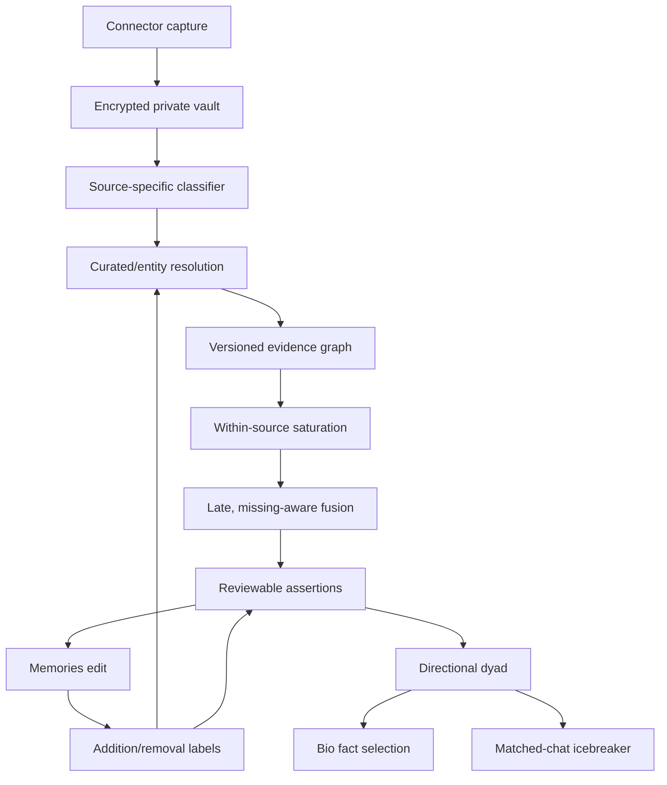

# Written semantic system engineering specification

**Version:** 0.3.1  
**Audience:** backend, iOS, data, ML, privacy, and product engineers  
**Status vocabulary:** `implemented decision core`, `schema-ready`, `present
legacy—adapt/replace`, `integration-required`, `future`

This is the authoritative end-to-end specification for Written's broad private
ingestion, rigorous ontology, Memories, purpose-scoped matching,
viewer-conditioned bio selection, and matched-chat icebreakers. The governing
rule is **capture broadly, promote narrowly, label rigorously**. Retention and
semantic eligibility are distinct decisions. The code is an executable
decision-core and database scaffold; it is not represented as a fully deployed
production service.

The repository-specific overlay is
[`WRITTEN_REPOSITORY_INTEGRATION.md`](WRITTEN_REPOSITORY_INTEGRATION.md), pinned
to `Shinghei98/Written` commit
`8203353532dffd5f608df92861fd8a631dc7b7d4` and migration head
`0041_collaborator.sql`. That app is a valuable connector and product-shell
baseline. It does not constrain this semantic contract. When the current app
and this specification disagree, this specification controls and the app path
is adapted or replaced.

All examples in this specification are synthetic placeholders. No user-level
Calendar title, route, itinerary, booking, or event detail is reproduced.
For repository navigation and executable commands, begin with
[`../README.md`](../README.md), then use
[`ACCEPTANCE_TESTS.md`](ACCEPTANCE_TESTS.md) and
[`VALIDATION.md`](VALIDATION.md) to distinguish package checks from native
deployment checks.

### Reading map

| Goal | Sections |
|---|---|
| Understand product truth and safety | 1–5: objective, invariants, status, objects, lifecycle |
| Implement source semantics | 6–11: ingestion, YouTube, Calendar, travel, ontology, scoring |
| Implement product surfaces | 12–16: Memories, dyads, bio, icebreakers, feedback |
| Ship and operate | 17–23: database contract, integration boundaries, jobs, evaluation, deployment, observability, traceability, glossary |

## 1. Product objective and scope

Written converts user-authorized observations from heterogeneous apps into
reviewable, typed assertions. The same assertion graph supports three distinct
product consumers:

1. **Memories:** a private multiresolution editor for what Written believes it
   has learned.
2. **Dynamic bio selection:** a directional choice of true facts about profile
   subject `B`, conditioned on viewer `A`, without changing those facts.
3. **Icebreakers:** a two-sided, evidence-backed bridge available only after a
   match and rendered with language licensed by the predicates on both sides.

The system must learn from user additions and one-tap removals, recognize
public entities and recurring terminology, and connect concepts across
sources. It must not convert consumption into identity, private calendar text
into public facts, or an inferred association into a stronger predicate than
the evidence licenses.

## 2. Non-negotiable invariants

1. The atomic semantic object is a **typed assertion**, not a label.
   `likes(Italy)`, `visited(Italy)`, `scheduled_travel_to(Italy)`, and
   `hometown(Italy)` may share a concept but are not interchangeable.
2. Raw observations, mappings, concepts, assertions, and presentation choices
   are separate records with separate versions.
3. Missing or denied sources are unknown. They never become negative interest.
4. Repeated representations of one item share a content lineage. Connector
   mirrors do not create additional evidence breadth.
5. Parent and child concepts are resolutions of shared evidence. They do not
   multiply evidence mass.
6. User-added or confirmed information has high explicitness. That does not
   make a free-text canonical mapping certain.
7. One-tap removal means "do not show this assertion here." It provides no
   reason, no dislike label, and no automatic global ontology correction.
8. One strong structured ticket is sufficient for a high-confidence
   `scheduled_travel_to`, `booked_activity_at`, `booked_event`, or
   `scheduled_dining` Memories candidate. A second app is not required.
   Recurrence evidence is required only for words such as "often" or "returns
   regularly."
9. A booking does not prove attendance; a past itinerary does not prove
   boarding; travel does not imply liking; recurrence does not prove hometown.
10. `hometown`, `lives_in`, `nationality`, ancestry, native language, health,
    religion, politics, ethnicity, and sexual orientation are explicit-only or
    prohibited as machine inferences.
11. Future itinerary details, dates, flight numbers, hotels, and private
    calendar context never enter a bio or icebreaker.
12. YouTube channel, represented creator, publisher, and content subject are
    distinct graph nodes/relations. A channel title alone cannot establish any
    of them.
13. YouTube cross-source fusion and public/dyadic surface use default off and
    require an approval mode that matches Written's audited scope.
14. HealthKit is an optional `fitness_connection` input. Raw/structured records
    never enter the generic term mapper. Only versioned, recurrence-qualified
    fitness routines may become reviewable evidence, and they remain
    purpose-locked after confirmation.
15. Recency is a versioned ranking feature, never a new personal claim. Rules
    are keyed by domain, source, and action; one universal half-life is
    prohibited. Every mapped decision uses one pinned `as_of`, and temporal
    weight remains separate from missing-timestamp quality.

## 3. System boundaries and status

| Component | Status | Location |
|---|---|---|
| Eight-column export inspection and source gates | implemented | `export_adapter.py` |
| Immutable source policy shared by adapter and mapper | implemented/schema-ready | `source_policy.py`, SQL 004 |
| Versioned concepts, aliases, relations, scoring | implemented | `graph.py`, `mapping.py`, `scoring.py` |
| Addition/removal feedback semantics | implemented | `feedback.py`, SQL RPCs |
| YouTube channel-role/content resolver | implemented decision core | `youtube.py` |
| Calendar privacy classifier and travel reconstruction | implemented decision core | `calendar_semantics.py` |
| Typed HealthKit ingestion, coverage, and fitness-habit abstention | implemented decision core | `healthkit.py` |
| Addition granularity and conserved propagation | implemented decision core | `granularity.py` |
| Memories, dyadic transport, bio, icebreaker | implemented decision core | `surfaces.py` |
| Domain/action recency and replay provenance | implemented decision core/schema-ready | `recency.py`, mapping/scoring, SQL 004 |
| Flight/journey, non-flight booking, surface, Memories, dyad, bio, and icebreaker persistence | schema-ready | `sql/004_product_surfaces.sql` |
| Private raw vault and purpose-limited fitness persistence | schema-ready | `sql/005_private_ingestion_and_fitness.sql` |
| Per-scope current state, service-owned run finalization, exact fact attestation, and match epochs | schema-ready/PGlite contracts passed; native required | `sql/006_current_state_and_surface_hardening.sql` |
| Postgres queue lease/retry mechanics | implemented | `repository.py`, `worker.py` |
| Closed contracts for all eleven job payloads, pre-dispatch validation, and SQL queue/result/error firewall | implemented | `job_contracts.py`, `worker.py`, SQL 005 |
| Production job repositories and handler registration | integration-required | product backend |
| Current iOS Memories/dashboard, discovery, match-profile, and icebreaker shells | present legacy—adapt/replace | pinned Written repository |
| Typed iOS ingestion and authenticated server-owned semantic RPCs | integration-required | Written app/backend |
| Production airport/event vendor catalogs | integration-required | licensed/curated data |
| Outcome-trained ranking weights | future | only after sufficient user outcomes |

No engineer should interpret `schema-ready` as deployed or `implemented
decision core` as wired to production storage. `Integration-required` means
application/runtime wiring, native deployment validation, or a client surface;
the normalized candidate and defense-in-depth database contracts themselves
are present in standalone reference migrations 004–006.

## 4. Canonical object model

| Layer | Definition | Example |
|---|---|---|
| Private raw record | Encrypted owner-scoped source payload, not ontology evidence | Whole Calendar event; structured HealthKit sample |
| Source observation | What a connector measured | Liked video; imported flight ticket |
| Typed mention | A locally extracted field | Channel ID; destination airport; provider topic |
| Mapping | Why a mention may denote a concept | Exact alias; curated airport code |
| Canonical concept | Reusable entity or topic | City A; Genre A; Creator A |
| Graph relation | Meaning between concepts | `broader`, `channel_represents`, `located_in` |
| User assertion | Predicate plus concept | `visited(City A)` |
| Evidence family | One causal support path across resolutions | Tuscan restaurant → Italian cuisine → Italy |
| Surface permission | Selection, naming, explanation authorization | May select for bio but not name evidence |
| Surface fact | Sanitized, predicate-licensed phrase | "Often returns to City A" |
| Dyadic bridge | Two typed paths meeting at a concept | Cuisine A → Region A ← City A |
| Data-use purpose | Non-launderable authorization scope | `general_social`; `fitness_connection` |

The database keeps stable concept identity separate from a versioned concept
revision. Every derived result records ontology, model, and user input
revisions.

## 5. End-to-end lifecycle



### 5.1 Version and race contract

- An ingestion changes the user's input revision.
- A semantic run snapshots that revision.
- Finalization is compare-and-swap: stale output remains historical and cannot
  advance current pointers.
- A removal writes its suppression and increments the revision atomically.
- Dyadic output snapshots **both** users' revisions. A change by either user
  invalidates provisional dyads, bios, and unexposed icebreakers. An exposed
  icebreaker remains an immutable historical message; it is never silently
  rewritten, but any later generation must use current revisions.
- Worker side effects must be idempotent because a process can commit and crash
  before acknowledging its lease.

## 6. Source ingestion contracts

### 6.1 Music and podcasts

- Provider recommendations are not user choices.
- Library, playlist, rating, and recent rows may represent the same catalog
  object. Keep row identity and content lineage separate.
- Use verified provider catalog IDs before public-knowledge resolution.
- Artist, album, work, genre, host, and show are different roles.
- Saturate within lineage and source so a long autoplay session does not
  overwhelm a small number of deliberate actions.

### 6.2 Explicit user/profile rows

Age, bio, education, gender, gender preference, occupation, flirt level, and
response time remain typed self-reports in the profile domain. They are not
behavioral ontology observations. Location is current-location/filter state,
not hometown, nationality, or cultural affinity.

### 6.3 HealthKit

The adapter normalizes Health/HealthKit/Apple Health/Motion aliases to one
canonical `healthkit` source and accepts four closed, purpose-minimized private
record contracts:

| Record | Accepted structure | Semantic effect |
|---|---|---|
| `activity_day` | date, bounded steps/active energy, optional first-move time | coverage/quality only; never nominates a sport |
| `activity_hour` | unique hour, bounded steps, share in `[0,1]`; a complete 24-bin share snapshot must sum to approximately one | timing coverage only; never nominates a workout |
| `workout` | allowlisted activity type plus start and duration/end | may support a controlled activity routine |
| `sleep` | structured stage/session times and duration | typed-private coverage only; never a semantic candidate |

Sleep has no v0.3.1 semantic-promotion path. It may contribute only to private
`sleep_typed`/`mixed` coverage and is ineligible for matching, naming,
explanation, or another public/product surface. The reserved
`routine:consistent_sleep_schedule` seed may remain for ontology compatibility;
it does not authorize a HealthKit candidate.

Unknown types, malformed/nonfinite values, free-text workout names, routes,
heart-rate values, diagnoses, and unapproved metrics fail closed. The accepted
records remain private quantitative evidence. They cannot be externally
resolved, embedded, globally mined, used for advertising, used for general
desirability or unrelated dating profiling, or used for population-model
training.

Policy `written-healthkit-fitness-v1.0.0` abstains unless support clears fixed
recurrence gates: an activity routine needs at least four same-type workouts in
42 days across three ISO weeks; a daypart needs at least six workouts, three
weeks, and 70% concentration. There is no sleep-promotion threshold: even
repeated or stable typed sleep sessions emit no semantic candidate. One workout
is a private completed activity, not evidence that the user "likes" it or "is a
runner."

Derived facts carry `data_use_purpose=fitness_connection`. Both users must
separately enable fitness matching. Bio naming, icebreaker naming, and
controlled explanation are independent opt-ins. Confirmation cannot erase
HealthKit provenance or widen its purpose.

The finalized example contains 365 `activity_day` and 24 `activity_hour` rows,
with no workouts or sleep. V0.3.1 accepts all 389 records into the private typed
lane, reports `aggregate_only`, and emits zero fitness-habit candidates.

### 6.4 Production export correction

The semicolon-packed `extra` column is transitional. Production ingestion
must send typed JSON or normalized fields because values may contain
semicolons. Required common fields include stable provider event ID, source
revision/etag, status, source time zone, occurrence time, connector type,
action, and provenance.

## 7. YouTube: channel, creator, and content

### 7.1 Required graph

```text
video --uploaded_by--> youtube_channel
youtube_channel --channel_represents--> person | group | show
video --content_by--> creator
video --content_about--> topic | person | entity
video --features--> person | work
```

`uploaded_by` never entails `channel_represents`. A broadcaster, fan channel,
label, repost account, and celebrity channel can all upload a video about the
same celebrity.

### 7.2 Channel role taxonomy

| Role | Meaning | Creator transfer |
|---|---|---|
| `official_creator` | Exact channel represents a person/group | permitted when active exact-ID resolution exists |
| `publisher` | Network, broadcaster, label, outlet | no featured-person transfer |
| `topical` | Topic/brand channel; content dominates | no person transfer |
| `fan_repost` | Fan, clip, compilation, repost | prohibited |
| `unknown` | Insufficient role evidence | abstain |

The stable `UC...` channel ID is authoritative. Channel titles may change.
An exact curated or exact Wikidata P2397 match may propose a resolution, but a
fuzzy name match cannot activate one.

### 7.3 Initial evidence weights

These are versioned ranking weights, not probabilities.

| Action/term | Weight behavior |
|---|---:|
| Provider topic on liked video | 1.00 term multiplier |
| Uploader tag under approved mode | 0.65 |
| Written title-derived candidate under approved mode | 0.55 |
| Channel identity from one liked/shared video | 0.25 |
| Represented creator from one liked video | 0.20 |
| Channel identity from subscription | 1.00 |
| Represented creator from subscription | 0.85 |
| Publisher from subscription | 0.55 |
| Fan/repost → featured celebrity | 0.00 |

Repeated distinct videos from one creator saturate toward a stronger creator
signal; the same video repeated does not. Content and creator paths retain
separate provenance even if the UI later shows adjacent chips.

### 7.4 YouTube policy mode

The decision core exposes independent gates for:

- channel identity terms;
- exact channel-role resolution;
- uploader tags;
- Written-derived title tags;
- cross-source fusion;
- bio use;
- icebreaker use.

All but provider topics default off. Reference migration 004 stores the approved
configuration with each semantic run in `youtube_run_policies`; a new run gets
a deny-all row automatically. Enabling a gate requires an active, unexpired
`youtube_policy_approvals` record, an approved YouTube resolver model, and a
policy scope no broader than that approval. Revocation is checked dynamically.
Provider-topic mappings can retain source-local scores without an approval,
but `cross_source_fusion_allowed` remains false unless the run is explicitly
licensed. The configuration is never an unlogged process boolean. Google
documents video/channel fields in the YouTube Data API and, as of this spec,
requires explicit approval for additional derived metrics. Its general policy
also restricts merging YouTube API data with other data. Written must obtain
audit language covering the exact private aggregation and surface behavior it
deploys.

This is an enforced evidence boundary, not descriptive metadata. The mapping
layer and SQL mapping/channel-evidence guards persist
`cross_source_fusion_allowed`; the scorer keeps false-gated evidence eligible
only for its source-local score and removes it from cross-source breadth,
synergy, and motif convergence. Surface permission/fact guards also prevent
policy laundering into matching, bio, icebreaker, or explanation. Tests cover
mixed gated/ungated evidence, deny-all runs, approval scope, revocation, and
weak one-video creator transfer.

Official references:

- https://developers.google.com/youtube/v3/docs/videos
- https://developers.google.com/youtube/v3/docs/channels
- https://developers.google.com/youtube/terms/derived-metrics-policy
- https://developers.google.com/youtube/terms/developer-policies-guide
- https://www.wikidata.org/wiki/Property:P2397

## 8. Calendar: allowlist-first semantic extraction

Calendar is often a high-signal receipt layer: airlines, Ticketmaster,
Eventbrite, live-show vendors, tour operators, hotels, OpenTable, Resy, other
reservation platforms, and attraction sites can create events after a
deliberate purchase. Calendar
must therefore not be discarded wholesale. It also contains unusually private
and misleading text, so unknown entries must fail closed.

The fail-closed rule applies at the **ontology promotion boundary**, not at
capture. With user authorization, the connector may retain complete events in
`private.raw_source_records` as application ciphertext or an encrypted blob
reference with an owner, consent purpose, retention policy, lifecycle state,
and keyed identifiers. That private vault enables reclassification and
deletion without making the event an assertion. Raw titles, routes, exact
times, contacts, organizers, and booking details must not be copied into
generic observations, mapping terms, worker payloads, logs, classifier-feature
JSON, or presentation JSON.

### 8.1 Classification order

Run locally in the private worker before embeddings, term mining, or online
knowledge calls:

1. Reject user-removed, cancelled, or declined events.
2. Reject birthday/subscribed/holiday calendar children.
3. Reject medical, therapy, surgery, funeral, memorial, religious, political,
   legal, and immigration events.
4. Reject friends'/colleagues' travel or arrivals, weddings, anniversaries,
   parties, and other private social events.
5. Reject work/school/meeting/Zoom/lab/class/interview/deadline events.
6. Reject explicit third-party ownership, shared third-party calendars, or a
   declined attendee state unless a separate typed artifact proves the user
   owns the booking.
7. Accept a strong structured flight signature.
8. Accept a verified or strongly structured leisure ticket/reservation.
9. Quarantine everything else as unknown private calendar data: retain it only
   in the private raw vault, and emit no semantic evidence.

The exclusion gates run before the commercial allowlist. A `booked=1` marker
alone is insufficient because an ordinary meeting can be marked booked.

### 8.2 Ticketed events

A single high-quality commercial ticket is enough to create a private, typed,
reviewable candidate. No orthogonal app evidence is required.

| Input | Output predicate | Licensed meaning |
|---|---|---|
| Airline itinerary | `scheduled_travel_to(place)` | a trip was scheduled/booked |
| Tour/attraction ticket | `booked_activity_at(place)` | activity was booked |
| Ticketmaster/Eventbrite/live-show ticket | `booked_event(event/topic)` | event was booked |
| Restaurant reservation | `scheduled_dining(cuisine/place)` | dining was scheduled |
| Past ticket without confirmation | same scheduled/booked predicate | not proof of attendance |

Recognized vendor identity also supplies the safe booking subtype when private
title text is absent: generic Ticketmaster/Eventbrite receipts map to
`booked_event`, OpenTable/Resy receipts map to `scheduled_dining`, and other
allowlisted leisure receipts map to `booked_activity_at`. Raw titles are
collapsed to controlled category labels before a `BookedActivity` leaves the
classifier. If a stable vendor event ID or independently verified public
catalog match resolves a public event, performer, venue, or restaurant, the
sanitized candidate may retain that public entity with a booked/scheduled
predicate. Free-text-only titles may produce only a controlled category or
abstention. A strong structured `Ticket:`/tour pattern can still be sufficient
when privacy exclusions are clear.
Production vendor registries should include stable IDs/domains for major live
event, tour, attraction, dining, hotel, and transport platforms. Vendor lists
are versioned configuration, not semantic truth.

Reference migration 004 persists Calendar classifications, canonical flight/journey
lineage, terminal-only scheduled-travel candidates, and normalized
`booked_activity_candidates`. The latter carries a typed predicate and target,
keyed source lineage, state/confirmation, recency provenance, Memories-only
surface restrictions, default-deny RLS, and service-role grants.
`calendar_event_classifications.feature_snapshot` remains classifier metadata,
not a candidate record.

Reference migration 005 closes the historical generic path: no Apple/Google Calendar
observation can enter `observation_mappings`, even after an eligible
classification. Promotion is available only through a current typed travel or
booking candidate. During upgrade, legacy typed rows remain available for
private audit, but affected user revisions are bumped and reclassification is
queued; the old rows are non-current and ineligible until a current
classification and typed candidate are rebuilt.

Presentation is also closed. The server replaces legacy free-text payloads and
constructs `calendar-v03` display payloads from controlled predicate labels and
active ontology `preferred_label` values. Memories labels are derived from those
candidate payloads. Connector/classifier titles, locations, or display labels
and client-authored text cannot control a rendered Calendar label.

### 8.3 Finalized-export disposition

The finalized export contains 106 event rows plus 10 Calendar-container rows.
The mutually exclusive v0.3.1 disposition is:

| Disposition | Events |
|---|---:|
| Included sanitized semantic rows | 9 |
| Unknown/not allowlisted | 60 |
| Work/school/meeting | 18 |
| Personal or third-party | 11 |
| Sensitive | 3 |
| Cancelled | 1 |
| User removed | 4 |
| **Total** | **106** |

The nine included rows collapse to five independent evidence lineages: four
mirrored flight legs and one booked activity. A prior engineer estimate of
roughly ten survivors is directionally right, but its displayed categories sum
to 128 because they overlap; it is not an exclusive partition.

### 8.4 Required production Calendar fields

Google Calendar exposes stable fields such as event `id`, `iCalUID`, status,
source URL/title, `eventType`, organizer/creator self flags, time zones,
recurrence, location, attachments, and attendee response. Export and type the
fields; do not flatten them into title text. See:
https://developers.google.com/workspace/calendar/api/v3/reference/events

For flights, request or derive locally:

```text
departure_airport, arrival_airport, carrier_code, flight_number,
departure_utc, arrival_utc, start_timezone, end_timezone,
provider_event_id, iCalUID, reservation_id_hmac, status,
autogenerated, owner_is_user, source_vendor
```

Organizer, attendee, contact, email, meeting URL, and booking code never become
ontology terms. The handler constructs only controlled classifier/category
fields, and migration 004 adds recursive key denial, root allowlists, depth,
string-length, and byte-size constraints to classification, derivation, and
presentation JSON. Application sanitization and the database firewall are both
required; neither permits raw-field copies.

## 9. Flight segments, journeys, and recurrence

### 9.1 Parsing and identity

A strong legacy-row signature requires a flight-pattern title with a valid
carrier/number, an unambiguous locally resolved endpoint, plausible duration,
and non-cancelled state. Generic labels, ambiguous endpoint strings, or a
person's arrival must abstain.

Connector mirrors share a keyed lineage:

```text
HMAC(server_key, carrier | flight_number | origin | destination | departure_utc)
```

Do not use a plain enumerable hash in production.

Reference migration 004 stores the 64-hex keyed segment lineage once on the canonical
segment and records primary/mirror source rows separately. Segment origin is
optional when the destination is uniquely resolved. Journeys receive their own
lineage HMAC and optional round-trip group HMAC. A scheduled-travel candidate
has a composite foreign key to the journey terminal; a connection leg cannot
satisfy it.

### 9.2 Journey construction

Join consecutive segments when the prior destination equals the next origin
and the layover is 30 minutes–18 hours. For 18–36 hours, require a shared
reservation identifier; otherwise mark ambiguous. A hotel or local booked
activity at the intermediate location turns the connection into a stopover.

An itinerary is the independent evidence unit. Flight + hotel + tour in the
same trip support one trip; they do not manufacture three journeys. Transit
airports receive no destination affinity.

### 9.3 Ticket and recurrence scoring

For journey `j` and terminal place `p`:

\[
e_{jp}=\max_k
\left(w_{type}\,q_{parse}\,q_{owner}\,w_{role}\,w_{status}\right)
\]

The maximum is taken within a journey. A structured flight begins around
`0.85`; a strong tour/attraction booking around `0.65`; an unambiguous manual
route around `0.65`. These are ranking weights.

One journey with `e >= 0.55` is eligible for a booked/planned Memories
candidate. This rule deliberately does **not** require multiple sources.

Recurrence uses distinct journeys:

\[
R_p=\bar e_p
\min\left(1,\frac{n_p-1}{2}\right)
\min\left(1,\frac{spanDays}{180}\right)
\times terminalFraction
\]

- `recurring_travel_candidate`: at least two distinct journeys in at least two
  months and spanning at least 90 days.
- "Often returns": at least three distinct journeys over at least 180 days,
  at least two complete round trips, explicit user confirmation, and the
  relevant naming permission before public wording.
- A private possible-base prompt may use stronger recurrence and route-balance
  requirements. It asks a question; it never writes hometown.

### 9.4 Wording license

| Evidence | Memories | Bio/icebreaker |
|---|---|---|
| One future/past ticket | "A trip to X appeared in your plans" | prohibited |
| One tour ticket | "Booked activity in X" | prohibited until confirmed |
| Repeated unconfirmed trips | "X recurs in your travel plans" | prohibited |
| User confirms `visited` | "Visited X" | "Has traveled to X" if permitted |
| User confirms `returns_to` | "Often returns to X" | same if permitted |
| User explicitly adds `hometown` | "Hometown: X" | "X is home" if permitted |

Never show exact dates, flight numbers, airports, hotels, or future itinerary.

## 10. Ontology structure and granularity

Broad hubs are stable navigation/governance anchors. Source apps are not hubs.
Below hubs, concepts form a polyhierarchical DAG plus typed associative edges.
Embeddings retrieve candidates; they do not create entailment.

### 10.1 Addition contract

- Selecting a canonical term gives high explicitness and high semantic mapping
  certainty.
- Free text gives high certainty that the phrase matters to the user, but its
  canonical mapping can remain unresolved.
- Preserve the original phrase regardless of proposed broader concepts.
- A relation-specific addition preserves its predicate:
  `hometown(Example City)`, `visited(Example City)`, and
  `travel_interest(Example City)` are different.
- A bare place addition becomes `explicit_association_with(place)` until the
  user or UI chooses a stronger predicate.
- An addition linked to a source observation may label the observation mapping
  positive. An unlinked addition teaches affinity only.

### 10.2 Upward propagation and mass conservation

```text
User adds "Tuscan trattorias"
  → exact user term: strongest
  → Italian cuisine: attenuated parent view
  → Italy: further attenuated association/view
```

All views share one `evidence_family` and one mass budget. A broad addition
never creates children. Parent and child can both appear in an expanded editor
but must not become independent votes in scoring or matching.

### 10.3 Removal contract

A one-tap removal suppresses the displayed predicate–concept assertion on that
surface and prevents immediate synonymous rerendering from the same evidence
family. It does not delete immutable observations, ancestors, descendants,
independent evidence, or the global mapping. Repeated exposure-normalized
removals are curator diagnostics, not automatic ontology edits.

### 10.4 Seed parity

The Python decision graph reads `ontology/seed_*.csv`; PostgreSQL bootstraps
the same shared catalog from SQL 003. `seed_consistency.py` parses both and the
tests require exact parity for 45 concepts, 42 aliases, and 37 edges, including
case, confidence, policy, status, and definition text. Relation types, source
policy, ontology lifecycle, models, embeddings, and motif execution settings
are intentionally SQL-only configuration and are listed explicitly by the
auditor.

## 11. Single-user evidence scoring

For user `u`, independence group `s`, and concept `c`:

\[
E_{usc}=1-\exp\left(-\sum_i
q^{source}_i q^{field}_i\,m_{ic}\,a_i\,T_i\,Q_i\,w^{path}_i
\right)
\]

`q` is source/field quality, `m` mapping agreement, `a` action × term weight,
`T` temporal recency weight, `Q` timestamp quality, and `w` path attenuation.
Contributions are capped within content lineage.

`source_policy.py` is the single immutable Python catalog for source layout,
reliability, and licensed action pairs. The adapter rejects an incompatible
source/action before constructing an observation, and the mapper imports the
same catalog. Reference migration 004 installs exact SQL policy parity. Its higher
Calendar reliability describes sanitized classifier output; historically, its
database trigger allowed a generic Calendar mapping only with an eligible
allowlisted classification. Reference migration 005 supersedes that path and rejects all
Calendar observations from generic `observation_mappings`. Generic source-row
mapping is fully closed for HealthKit as well: raw samples, daily/hourly
aggregates, workouts, and typed-private sleep never enter alias mapping. Only an
exact, validated, non-sleep `fitness_habit`/`routine` candidate projection may
use the closed mapping-persistence handoff; it cannot discover a concept from a
source term or broaden beyond its bound candidate.

### 11.1 Versioned recency policy

Recency policy `written-recency-v1.0.0` is keyed by `(domain, source, action)`.
There is no connector-wide or universal half-life.

| Evidence family | Mode | Key timing |
|---|---|---|
| YouTube watched/video behavior | historical decay | 30-day half-life |
| YouTube share | historical decay | 60-day half-life |
| YouTube like | historical decay | 120-day half-life |
| Subscription/follow | enduring historical | 1,080-day half-life |
| Library/save | enduring historical | 1,440-day half-life |
| Explicit rating | enduring historical | 900-day half-life |
| Recent music play | historical decay | 120-day half-life |
| Recently added music | historical decay | 540-day half-life |
| Podcast play | historical decay | 180-day half-life |
| Scheduled Calendar event | anticipation then decay | 180-day anticipation window; 540-day post-event half-life |
| Derived fitness routine | current-routine decay | 21-day half-life and mapper eligibility stops at 42 days; the builder must refresh/retire a workout-derived candidate when its 42-day support window no longer qualifies |

For a historical rule with age `d`, floor `f`, peak `p`, and half-life `h`:

\[
T(d)=f+(p-f)\exp\left(-\ln(2)d/h\right)
\]

At an explicit expiry boundary the floor applies. For a scheduled event `d`
days in the future and anticipation window `A`, weight is `f` outside the
window and grows linearly inside it:

\[
T_{future}(d)=f+(p-f)\left(1-d/A\right),\quad 0\le d\le A
\]

It peaks at the event and follows the rule's post-event decay afterward. A
missing timestamp remains nonzero at the rule's
`unknown_timestamp_weight`, while `Q < 1` independently records lower temporal
quality. Unsupported keys and missing `as_of` fail closed.

Every evidence decision records `recency_weight`, `recency_quality`, policy
version, rule ID, temporal status, timestamp-quality state, and
`recency_as_of`. SQL pins mapping/channel evidence and aggregate-score clocks
to `semantic_runs.started_at`; linked motif/assertion evidence inherits the
mapping tuple. Scheduled-travel and booked-activity candidates retain the same
audit tuple. Aggregate score rows store the policy version and run clock rather
than pretending mixed evidence has one rule ID.

Fuse independence groups late:

\[
S_{uc}=1-\prod_s(1-\alpha_{sc}E_{usc})
+\sum_{s<t}\gamma_{stc}E_{usc}E_{utc}
\]

Cross-source synergy is capped and must never become a prerequisite for valid
single-source actions such as a ticket. Return separately:

- strength;
- mapping agreement;
- evidence quality;
- source breadth;
- leave-one-source-out stability;
- source coverage/comparability;
- surfacing acceptance.

None is labeled a probability without calibration.

## 12. Memories algorithm

### 12.1 Organization

1. Filter by safety, current revision, surface permission, and suppression.
2. Group by semantic hub, not source app.
3. Within each hub, rank lexicographically:
   safety/permission → explicitness → support/stability → specificity →
   information content → diversity → redundancy.
4. Select a nonredundant parent/child antichain for summary representatives.
5. Use an appropriate parent/subhub as heading.
6. Show two or three representative children plus an expanded editable list.
7. Put source badges and sanitized provenance in details, not ontology paths.

Example:

```text
Music
  Genre A
    Artists/channels: Creator A, Creator B
    Topics: performances, production

Places, travel & cultures
  Travel plans
    Destination A — confirmed visit
    Attraction B — booked activity
```

### 12.2 Editing

- Remove targets the actual assertion/evidence family, not the summary heading.
- A parent remains if independently supported after a child is removed.
- User additions rank highly but do not automatically become the numerically
  strongest lifelong interest.
- The UI should make predicate and granularity selectable for ambiguous adds.

## 13. Directional dyadic distance

Do not average a user's concepts into one embedding. That destroys
multimodality. Compare typed leaf/evidence-family assertions while using the
graph to obtain multiresolution distance.

For assertions `(r_i,c_i)` and `(r_j,c_j)`:

\[
d = \lambda_g d_{graph}(c_i,c_j)
  + \lambda_r d_{relation}(r_i,r_j)
  + \lambda_e d_{embedding}(c_i,c_j)
\]

- Exact concept: cost 0 before relation penalty.
- Parent/child: low cost per hop.
- Curated association: moderate cost and explicit bridge.
- Embedding-only candidate: retrieval path with extra penalty; it cannot
  license a factual bridge.
- `likes ↔ likes` is highly compatible; `visited ↔ travel_interest` is
  moderately compatible; `hometown ↔ travel_interest` is weak;
  `scheduled_travel ↔ interest` is weaker; transit is zero.

### 13.1 Unbalanced transport

The implementation uses KL-relaxed entropic transport because users have
different numbers of interests and missing views. For cost matrix `C`:

```text
K = exp(-C / epsilon)
tau = rho / (rho + epsilon)
u <- (a / (K v)) ^ tau
v <- (b / (K^T u)) ^ tau
P = diag(u) K diag(v)
```

A final capacity projection guarantees no assertion transports more than its
conserved mass. Disconnected or high-cost mass remains unmatched.

Return two headline outputs:

- **semantic proximity:** quality of transported pairs;
- **comparability:** transported mass × overlapping source coverage.

Missing sources lower comparability, not semantic proximity.

### 13.2 Purpose-scoped fitness comparison

`surface` and `data_use_purpose` are separate dimensions. A fact may be
displayable in private Memories yet illegal for a general-social dyad.
HealthKit-derived assertions are policy-locked to `fitness_connection`.
`DyadicMatcher.match` must receive that purpose, both users must hold active
`allow_fitness_matching` grants, and a database guard rejects HealthKit evidence
from a `general_social` run. `allow_bio_naming` and
`allow_icebreaker_naming` are independent grants; controlled explanation is an
additional grant and also requires the applicable naming grant. Confirmation may
strengthen review state; it may not rewrite provenance or purpose.

## 14. Dynamic bio selection

This operation is directional: `Bio(A views B)` is not `Bio(B views A)`.

1. Freeze current revisions for viewer and subject.
2. Build the dyadic transport plan.
3. Rank subject `B`'s displayable facts by salience, truth quality, specificity,
   information content, and nonredundancy.
4. Select two stable clauses independent of viewer.
5. Select at most one additional subject fact whose bridge to viewer has high
   transport utility.
6. Render only facts about `B`. Viewer information chooses/reorders; it never
   changes the truth condition.

Pure distance minimization would select generic `Music` or `Travel`. Require a
minimum information-content threshold and prefer the most specific licensed
bridge.

## 15. Icebreaker generation

An icebreaker exists only for a currently authorized match/chat and uses:

```text
left assertion --typed path--> bridge <--typed path-- right assertion
```

For bridge `g`:

\[
score(g)=H(P_A,P_B)\times specificity\times information
\times quality\times relationCompatibility\times(1-semanticCost)
\]

where `H` is the harmonic mean. Strong evidence from one person cannot rescue
speculative evidence on the other.

### 15.1 Wording licenses

| License | Requirements | Headline |
|---|---|---|
| `both_like` | both confirmed/user-added liking/affinity; strong support | "You both like Italy." |
| `shared_thread` | two reliable compatible typed paths; no embedding-only bridge | "Italy looks like a shared thread." |
| `conversation_topic` | weaker/unknown polarity but safe relation | "Italy could be a conversation topic." |

Example validated frame:

```json
{
  "bridge": "Region A",
  "license": "shared_thread",
  "left_fact": ["likes", "Cuisine A"],
  "right_fact": ["returns_to", "City B"]
}
```

Deterministic V1 rendering:

> Tip: Region A looks like a shared thread. You like Cuisine A, and your match
> often returns to City B.

The second clause is allowed only if the profile subject explicitly confirmed
`returns_to` and permitted it. A flight ticket alone keeps that fact in
Memories. If an LLM later paraphrases, it receives only this closed validated
frame—never raw Calendar or arbitrary YouTube text.

### 15.2 Staleness and first exposure

Match-time generation is provisional. Immediately before an icebreaker is
first exposed, the server atomically proves the match authorization is active
and the dyad still matches both users' current revisions. If either revision
changed, the unexposed frame becomes stale and must be rebuilt. Once exposed,
the text and validated frame are immutable historical message content; a later
revision does not silently rewrite what a participant already saw. Any new
icebreaker or reuse decision must revalidate current dependencies.

## 16. Feedback and learning

Learn two targets separately:

1. **Semantic validity:** did source evidence map to the right concept and
   predicate?
2. **Surfacing acceptance:** does this user want the true/reviewable assertion
   shown on this surface?

### Addition

- Existing canonical selection: strong explicit assertion.
- Free text: strong user-importance label; mapping may remain candidate.
- Linked correction: positive observation-to-concept label after ownership and
  presentation validation.
- Unlinked addition: no source mapping label.

### One-tap removal

- Strong user-specific surfacing negative for that assertion/surface.
- No negative-interest label.
- No reason collection or inferred reason.
- No global mapping negative.
- Suppression tombstone wins over stale recomputation.
- Aggregate exposure-normalized removals can queue a rule/parser for human
  review after a minimum distinct-user threshold.

## 17. Database contract

Apply the standalone reference migrations in order:

```text
001_schema.sql
002_rls_and_rpc.sql
003_seed.sql
004_product_surfaces.sql
005_private_ingestion_and_fitness.sql
006_current_state_and_surface_hardening.sql
```

For the packaged contracts, run tests 001–003 after migration 003, then apply
004, replay 004 once, and run contract 004; apply/replay 005 and run
contract 005; then apply/replay 006 and run
`006_current_state_and_surface_hardening_contract.sql`. Contracts 001–003 intentionally assert the pre-004 surface
whitelist and are not post-004 regression tests.

Reference migration 004 adds or extends:

- typed YouTube channel identities, reviewed role resolutions, per-run
  approval gates, evidence fusion boundaries, and weak creator transfer;
- private Calendar classifications, canonical keyed flight segments with
  mirror sources, journeys/terminals/round-trip lineage, scheduled travel,
  recurrence review, and typed non-flight booking candidates;
- per-assertion Memories/matching/bio/icebreaker
  selection/naming/explanation permissions;
- Memories snapshots/items;
- directional dyad runs and alignment pairs with two-user revisions;
- validated surface facts;
- versioned bio variants;
- match authorizations and icebreaker frames;
- separate mapping agreement, evidence quality, evidence weight, and versioned
  recency provenance;
- exact Python/SQL source-policy parity, with one immutable Python catalog,
  source-specific adapter gating, and the historical migration-004
  allowlist-only Calendar mapping guard;
- recursive, size-bounded, root-allowlisted JSON firewalls;
- product worker job types, invalidation triggers, default-deny RLS, and
  service-role-only grants.

Reference migration 005 adds:

- encrypted/blob-backed, owner-scoped private raw retention with consent,
  retention, and lifecycle fields;
- sanitized Calendar and fitness privacy classes and payload firewalls;
- a superseding prohibition on every generic Apple/Google Calendar
  `observation_mapping`, with semantic promotion only from current typed
  Calendar candidates;
- revision-bump/reclassification remediation that retains legacy typed Calendar
  rows for audit while making them non-current and ineligible pending rebuild;
- canonical server-generated Calendar candidate and Memories labels built from
  controlled predicate templates and active ontology preferred labels;
- active raw HealthKit ingestion with raw mapping structurally prohibited;
- fitness feature snapshots, versioned coverage/recurrence guards, controlled
  workout-derived candidates, typed support rows, typed-private sleep coverage,
  and assertion lineage;
- independent `fitness_connection` surface grants and bilateral dyad checks;
- the closed `derive_fitness_habits` job; and
- first-exposure revalidation plus immutable exposed icebreakers.

Reference migration 006 adds current-source-state and surface hardening. It
must make finalized run membership—not “latest ever seen”—the authority for
affirmatively observed items. Finalized partial, truncated, and delta scopes
may affirm or update items they actually report, including an explicit provider
deletion; only a finalized complete full snapshot may infer absence from an
omitted item. Failed runs and all other omissions remain unknown. Stale or
client-authored semantic projections cannot become current surface output. Its
exact executable contract is
`sql/tests/006_current_state_and_surface_hardening_contract.sql`.

Source authority is scoped by `(user, source, scope_key)`. Disjoint scopes do
not supersede each other; a multi-scope finalization locks every scope head in
canonical order and aborts without partial effects if any overlapping scope is
stale. The service role can stage immutable manifests/items but cannot update
run status or current pointers. Only the fixed-path service functions may
finalize or fail a run, their retries are receipt-idempotent, and every terminal
run is immutable. Raw-record, observation, and membership staging locks the
running run row against finalization, preventing late appends from changing the
set covered by a terminal receipt.

Every new validated surface fact must attest the exact current user revision
and, for an inferred assertion, its exact current score version. Pre-006 facts
have no such evidence. Migration 006 therefore retires them without backfilling
fabricated provenance, disables naming/explanation, and stales linked ready
bios and unexposed icebreakers while retaining audit links and immutable
already-exposed history. The persisted upgrade proof is
`sql/tests/fixtures/005_surface_fact_upgrade_fixture.sql` followed by 006,
replay, and `sql/tests/006_surface_fact_upgrade_contract.sql`.

Match authorizations are terminal epochs with immutable participants and
contiguous epoch numbers. Exactly one epoch may be active per product match,
and exactly one product match may be active for an unordered user pair.
Revocation and first exposure lock the same authorization row; renewal creates
a successor epoch instead of reactivating a terminal row.

These numbers belong only to the standalone reference chain. At the reviewed
Written head, app migrations already run through `0041`; the app's `0004` and
`0005` are unrelated. Adapt reference 001–006 into app `0042+`, translate
reference `private.*` to app `semantic_private.*`, and never run these files
unadapted against the current database.

### 17.1 Remaining integration boundaries

Reference migrations 004–006 close the packaged persistence/defense gaps. The
remaining work is runtime, deployment, policy approval, and client integration:

1. Implement production repositories and register handlers for all eleven closed
   job contracts. The worker rejects unknown, malformed, cross-user-mismatched,
   or privacy-forbidden payloads before dispatch, but it cannot provide product
   database effects that have not been wired.
2. Validate migrations, replay, RLS, extensions, and authenticated behavior on
   a disposable native Supabase project. Packaged PGlite is a strong contract
   check, not a hosted-environment substitute.
3. Replace packed export fields with typed connector payloads and maintain
   licensed/versioned airport, carrier, event, attraction, dining, and vendor
   catalogs. The package contains decision logic and synthetic fixtures, not a
   production catalog service.
4. Adapt the present legacy iOS Memories/dashboard, discovery, match-profile,
   and icebreaker paths into narrowly scoped server-owned discovery,
   bio, and icebreaker RPCs. Do not grant every authenticated account `select`
   on discovery tables. Each RPC derives the viewer from `auth.uid()`, proves
   block/privacy/rate-limit and match rules, validates both current revisions
   and exact surface/purpose grants, and returns sanitized output only.
5. Use only the deterministic, versioned renderer for ready bio/icebreaker
   rows. SQL validates linked facts and payload shape but cannot prove that an
   arbitrary sentence faithfully realizes them; never accept client-authored
   rendered text.
6. Obtain written YouTube approval for the exact fusion/surface behavior before
   enabling those run-policy flags in production. The ability to record an
   approval is not the approval itself.
7. Designate an authoritative `run_purpose`/model experiment when multiple
   configurations could finish against one unchanged revision.
8. Run the user-level evaluation and privacy review before enabling public or
   dyadic surfaces.
9. Implement an idempotent scheduled retention worker that expires and purges
   raw-vault payloads at `retained_until`. The schema validates retention shape
   and HealthKit grant revocation purges ciphertext, but no database TTL runs
   automatically.
10. Implement an envelope-encryption design using a KMS/HSM-controlled wrapping
    key, separately keyed lineage HMACs, audited worker decrypt, rotation, and
    deletion across database, object store, queues, logs, analytics, and
    backups.
11. Adapt and test the real Written `0001–0041 → 0042+` path. The standalone
    fixture-backed 004→005 test does not exercise `public.distilled_records`,
    `discovery_cards`, existing conversation triggers, or app `private` objects.
12. Prefer an audited exposed `api` schema and update the iOS PostgREST client
    to send the required schema-profile headers. If public wrapper functions are
    used instead, keep them minimal, security-definer, explicitly granted,
    pinned to a safe `search_path`, and derive the user from `auth.uid()`.
    Never expose `semantic_private`, app `private`, or `ontology` to the Data API.

The standalone reference `private` schema remains default-deny. The app must
place adapted semantic objects in `semantic_private`, which is also
default-deny. The v0.3.1 schema intentionally does
not expose a broad cross-user client read policy. Production RPCs must prove
authentication, match authorization where relevant, both current user
revisions, surface permission, and sanitized fact lineage.

Machine jobs are constrained from creating `hometown` or `lives_in`. Future or
unconfirmed Calendar claims cannot receive public/dyadic naming or explanation
permission.

The package validation baseline and exact SQL execution record are maintained
in `VALIDATION.md`; the full PGlite matrix now passes through reference 006.
Do not infer deployment from that result: native Supabase replay, RLS,
authenticated and two-session race behavior, and the adapted Written upgrade
remain release gates.

The current aggregate adapter check processes 2,539 rows into 1,830 semantic
observations. Calendar contributes 9 observations in 5 private lineages: eight
mirrored flight rows collapse to four canonical legs, plus one typed booked
activity. They reconstruct one round trip and produce zero recurrence or
possible-base candidates. None enters the generic mapper; any promotion uses its
current typed candidate. No route, activity, airport, or date is recorded in the
package report. The same run privately accepts all 389 HealthKit aggregate
rows (365 daily and 24 hourly), reports `aggregate_only`, and emits zero
fitness-habit candidates.

## 18. Worker job contracts

Required production handlers:

| Job | Inputs | Durable outputs |
|---|---|---|
| `map_observation` | observation ID + versions | mapping candidates/evidence |
| `classify_calendar` | private event ID + classifier version | classification or quarantine |
| `resolve_youtube_channel` | stable channel ID + resolver version | candidate/active role resolution |
| `recompute_user` | user + exact revision | scores/assertions/current pointer |
| `build_memories` | user + exact revision | snapshot/groups/items |
| `compute_dyad` | viewer/subject + both revisions | alignments/bridges |
| `render_bio` | dyad run + presentation version | validated bio facts/text |
| `render_icebreaker` | authorized match + dyad run | closed frame/text |
| `mine_terms` | privacy-thresholded aggregates | review candidates only |
| `refresh_external_entity` | existing external entity + refresher version | refreshed candidate provenance |
| `derive_fitness_habits` | user/revision + feature snapshot/builder/policy IDs | validated fitness candidates or explicit abstention |

`job_contracts.py` implements a closed typed registry for all eleven rows above.
For a registered handler, `SemanticWorker` validates and canonicalizes the
payload before dispatch. A job without a registered handler fails closed as
`dead_no_handler`; unknown fields, raw/private aliases, malformed IDs/versions,
and cross-user queue mismatches for a registered handler fail as
`dead_invalid_payload`, with sanitized codes. Unsupported job types cannot
enter the closed payload registry. Every registered production handler must
still make writes idempotent. The included queue/validation mechanics do not
replace application repositories or handler registration; wire and
integration-test them before starting a production poller. Calendar
serializers must construct controlled category/classifier fields only, and SQL
recursively rejects raw event, route, itinerary, contact, and booking keys from
derivation/presentation JSON.

## 19. Evaluation plan

### 19.1 Unit/integration gates

- channel roles: official creator, publisher, topical, fan/repost, unknown;
- stable channel ID across title changes;
- one liked video versus repeated videos versus subscription;
- domain/source/action recency rules, unknown-timestamp quality, a pinned run
  clock, short video decay, enduring follows/saves, and scheduled-event
  anticipation/post-event decay;
- calendar meeting/birthday/medical/funeral/friend/unknown exclusions;
- one strong ticket accepted without orthogonal proof;
- connector mirror deduplication;
- vendor-typed `booked_event`, `scheduled_dining`, and
  `booked_activity_at` candidates with controlled labels;
- connection airport excluded from terminal destination;
- one round trip does not become recurring or hometown;
- private recurrence requires the 2-journey/2-month/90-day floor; public
  "often returns" requires 3 journeys/2 complete round trips/180 days plus
  explicit confirmation and permission;
- user-confirmed predicate licenses stronger wording;
- free-text exact preservation and upward-only propagation;
- parent/child mass conservation;
- exact, parent/child, curated, embedding-only dyadic costs;
- missing sources affect comparability rather than similarity;
- generic bridge loses to specific informative bridge;
- weak evidence never emits `both_like`;
- future/private Calendar evidence cannot enter bio/icebreaker;
- Calendar container aliasing (`cal_type`) cannot bypass exclusions;
- aggregate-only HealthKit coverage yields no sport or habit;
- workout/daypart thresholds, deduplication, purpose locks, bilateral fitness
  grants, and revocation all fail closed;
- typed HealthKit sleep remains coverage-only and cannot create or reactivate a
  semantic candidate, including through the reserved sleep-schedule seed;
- revision change invalidates provisional downstream snapshots while exposed
  icebreakers remain immutable historical text;
- RLS/default-deny and forbidden inferred hometown constraints;
- all eleven job payloads are closed, validated before dispatch, and fail with
  payload-safe dead-letter codes.

### 19.2 Initial users

With 30–50 users, measure connector coverage, mapping precision, abstention,
confirmation/removal rate, granularity preferences, parser errors, and
wording acceptance. Keep weights fixed and interpretable. Do not claim learned
population correlations.

At roughly 100 richly connected users, calibrate a preliminary rule model on a
prespecified concept set, then freeze it and validate on a later cohort. Split
by user, never observation. Outcome-trained dyadic weights require several
hundred active users and sufficient matched-conversation outcomes.

## 20. Deployment sequence

1. Pin the Written commit/migration head and adapt standalone 001–006 into the
   next app migrations using `semantic_private`; do not alter the existing app
   `private` schema or copy the reference filenames.
2. Replace packed extras with typed connector payloads and a KMS-backed,
   owner-scoped raw-evidence writer with deletion and retention jobs.
3. Apply and validate the standalone reference chain and the real
   `0001–0041 → 0042+` app upgrade on separate disposable native Supabase
   projects.
4. Dual-write typed ingestion behind a flag while legacy reads remain live;
   correlate runs and shadow-compute without product effect.
5. Backfill legacy rows as `legacy_unverified`; require fresh distillation when
   complete current membership or purpose authorization cannot be proved.
6. Install versioned production airport/vendor and HealthKit activity catalogs;
   test typed booking and fitness-candidate persistence.
7. Keep every Calendar observation and raw HealthKit record outside the generic
   mapper. Promote Calendar semantics only from current typed candidates and use
   only server-controlled canonical labels; never use classifier feature JSON as
   a candidate or presentation store.
8. Implement source repositories and register handlers behind the closed job
   contracts.
9. Launch private Memories review first. HealthKit matching, bio naming,
   icebreaker naming, and controlled explanation remain independently off by
   default.
10. Run the 30–50-user cohort and review every false positive/unsafe path.
11. Canary the server-owned discovery/profile RPC, then enable confirmed/user-
    added facts and viewer-conditioned clause selection behind revision-safe
    experiments.
12. Enable matched-chat icebreakers using deterministic frames and atomic
    first-exposure validation.
13. Keep YouTube cross-source/public surface gates off until written audit
    approval covers the actual behavior.
14. After a minimum-client and rollback window, revoke legacy semantic writes/
    direct reads and disable the old conversation icebreaker trigger in a
    forward migration.
15. Add population-learned weights only after independent validation; exclude
    HealthKit data from that training path.

Every phase has independent flags for typed ingestion, semantic shadow,
Memories, discovery/profile clauses, icebreaker exposure, and HealthKit. A
server-side privacy kill switch stops promotion and cross-user exposure without
an app release. Rollback never re-enables generic Calendar/HealthKit mapping,
client-authored semantic JSON, or the legacy overlap icebreaker; omission is the
safe fallback. Production schema rollback is forward-only, not a destructive
down migration.

## 21. Observability

Track aggregate, privacy-safe metrics by model/version/source:

- input, accepted, quarantined, and abstained counts;
- legacy/new dual-write divergence by completed ingestion run, source, action,
  and provenance, without raw payload logging;
- complete, partial, failed, and truncated run counts; tombstone/absence changes;
- mapping agreement and margin;
- recency rule/status distribution, unknown-timestamp quality, and policy/as-of
  version drift;
- distinct content lineages and independence groups;
- ticket/flight parse precision and journey reconstruction errors;
- channel-role resolution precision and abstention;
- HealthKit coverage state, typed-record rejection, candidate abstention, and
  purpose-grant revocation—never raw quantities;
- assertion exposure, confirm, suppress, restore, and add rates;
- stale-run rejection and downstream invalidation;
- bio fact selection frequency and clause stability;
- icebreaker license distribution and adoption;
- conversation outcomes only with the required consent and governance.
- queue age, lease loss, retry/dead-letter, handler latency, and surface RPC p95;
- authorization denials, mutual-block filtering, stale-frame exposure attempts,
  retention backlog, KMS decrypt/rotation failures, and privacy kill-switch state.

Never log raw private Calendar text, itinerary, organizer/contact data,
HealthKit quantities/session times, closed surface facts, or user-identifying
term-mining rows.

Raw private fields in logs/analytics/queue errors, unauthorized cross-user
reads, exposed stale frames, and overdue purge without an active incident are
zero-tolerance conditions. Operational alert thresholds and rollback owners
must be defined before each surface is canaried; aggregate metrics alone are
not an incident response plan.

## 22. Traceability matrix

| Requirement | Decision code | SQL | Tests | Status |
|---|---|---|---|---|
| Immutable evidence/provenance | `models.py`, `mapping.py` | 001–002 | graph/mapping tests | implemented |
| Addition/removal semantics | `feedback.py`, `granularity.py` | 001–002, 004 | feedback/granularity tests | implemented/schema-ready |
| YouTube creator vs content | `youtube.py`, adapter | 004 channel tables | YouTube tests | implemented/schema-ready |
| YouTube cross-source fusion gate | `mapping.py`, `scoring.py` | 004 run approvals/policies, mapping/channel/surface guards | mapping/scoring + SQL contract | implemented/schema-ready; production approval required |
| Domain/action recency | `recency.py`, mapping/scoring | 004 evidence/score/candidate provenance | recency + SQL contract | implemented/schema-ready |
| Source-policy parity and gating | `source_policy.py`, adapter/mapping | 004–005 source policy + Calendar/HealthKit mapping triggers | source-policy + SQL contracts | implemented/schema-ready |
| Broad private raw retention | adapter counts/interfaces | 005 encrypted/blob raw vault | adapter + SQL contract | schema-ready; production encryption/retention wiring required |
| Per-scope current membership and server-owned terminal transitions | interfaces/spec | 006 scope heads/finalize/fail guards | SQL 006 contract | schema-ready; PGlite passed, native pending |
| Exact surface-fact attestation and safe 005→006 upgrade | interfaces/spec | 006 fact binding/retirement guards | SQL 006 + persisted fact-upgrade contract | schema-ready; PGlite passed, native pending |
| Canonical match authorization epochs | interfaces/spec | 006 epoch/pair/revoke/exposure guards | SQL 006 contract | schema-ready; PGlite passed, native race pending |
| Purpose-limited fitness derivation | `healthkit.py`, `surfaces.py` | 005 snapshots/candidates/support/grants | HealthKit/surface + SQL contract | implemented/schema-ready |
| Single-ticket high signal | `calendar_semantics.py` | 004 travel tables | calendar tests | implemented/schema-ready |
| Private event exclusion | `calendar_semantics.py`, `safety.py` | 004 classifications | calendar tests | implemented/schema-ready |
| Non-flight booked candidate persistence | `calendar_semantics.py` | 004 typed booking candidates | calendar + SQL contract | implemented/schema-ready |
| Travel mirror/terminal/recurrence defense | `calendar_semantics.py` | 004 HMAC/source/journey/threshold constraints | calendar + SQL contract | implemented/schema-ready |
| Memories grouping/editing | `surfaces.py` | 004 snapshots | surface tests | implemented/schema-ready |
| Dyadic distance | `surfaces.py` | 004 dyad runs/alignments | surface tests | implemented/schema-ready |
| Dynamic bio selection | `surfaces.py` | 004 bio variants | surface tests | implemented/schema-ready |
| Icebreaker frame/license | `surfaces.py` | 004–005 match/frame/exposure rules | surface + SQL contracts | implemented/schema-ready |
| Closed job payload validation | `job_contracts.py`, `worker.py` | queue + 004–005 job types | job contract/dispatch tests | implemented |
| Production connector/job wiring | interfaces/spec | queue + 004–006 job types | native integration required | integration-required |
| Written repository adaptation | repository overlay | app `0042+`, `semantic_private` | clean install + real `0001–0041` upgrade | integration-required; no adapted migrations packaged |

## 23. Glossary

- **Affinity:** defeasible interest/association, not identity.
- **Assertion:** predicate plus concept plus provenance about one user.
- **Breadth:** number of independent source groups with meaningful support.
- **Comparability:** how much of two profiles could reasonably be compared.
- **Concept:** reusable canonical entity/topic node.
- **Evidence family:** one causal evidence path across granularities.
- **Explicitness:** inferred, confirmed, or user-added status.
- **Information content:** rarity/specificity used to avoid generic bridges.
- **Lineage:** canonical item/trip identity used for deduplication.
- **Mapping agreement:** confidence in mention-to-concept interpretation; not a
  calibrated probability.
- **Private raw record:** encrypted owner-scoped source material retained for a
  declared purpose; it is not semantic evidence.
- **Data-use purpose:** non-launderable authorization scope governing where an
  otherwise valid fact may be used.
- **Recency quality:** independent weight for timestamp certainty; it is not the
  temporal decay weight.
- **Recency status:** auditable state such as recent, decaying, future
  anticipation, event-current, post-event decay, expired, or unknown timestamp.
- **Surface fact:** sanitized, permissioned, predicate-licensed statement.
- **Transit:** intermediate location that receives no destination affinity.
- **Typed assertion:** relation semantics retained with a concept.
